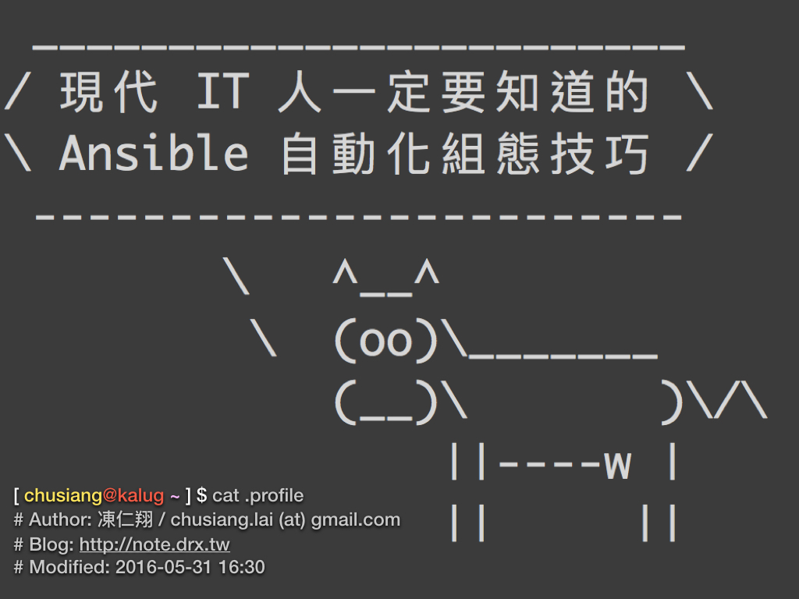
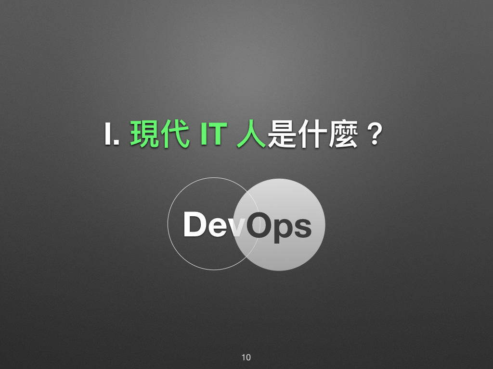
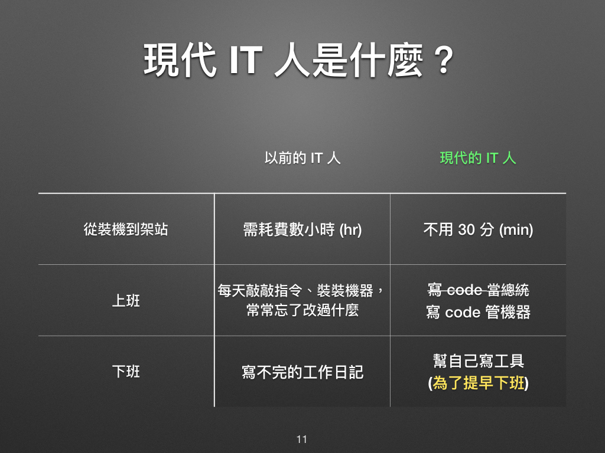
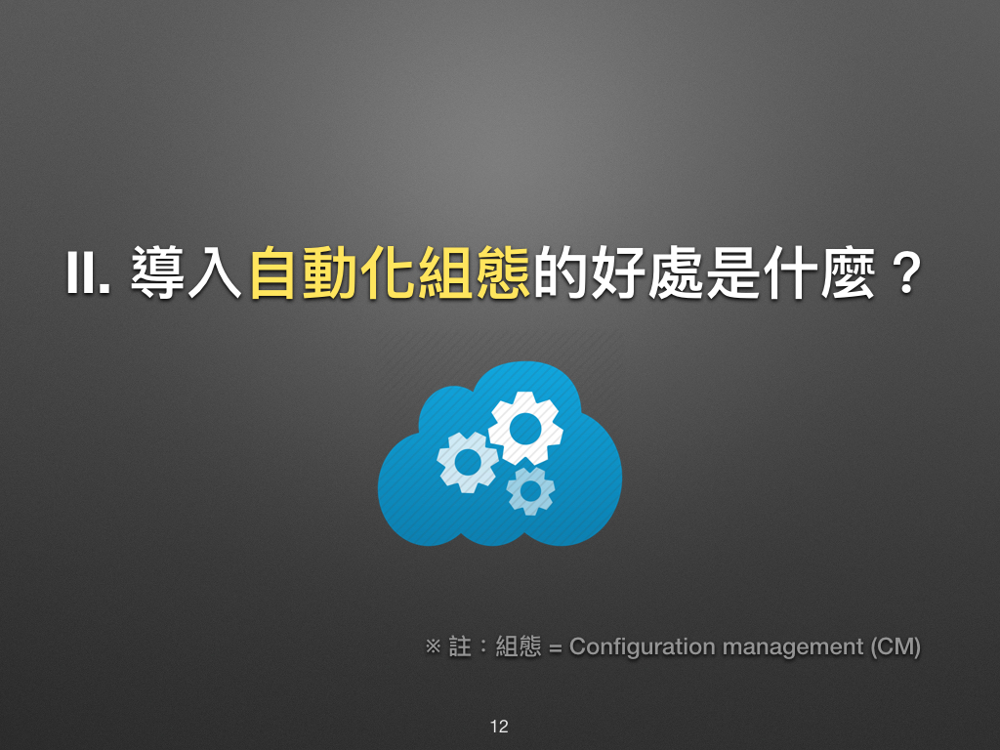
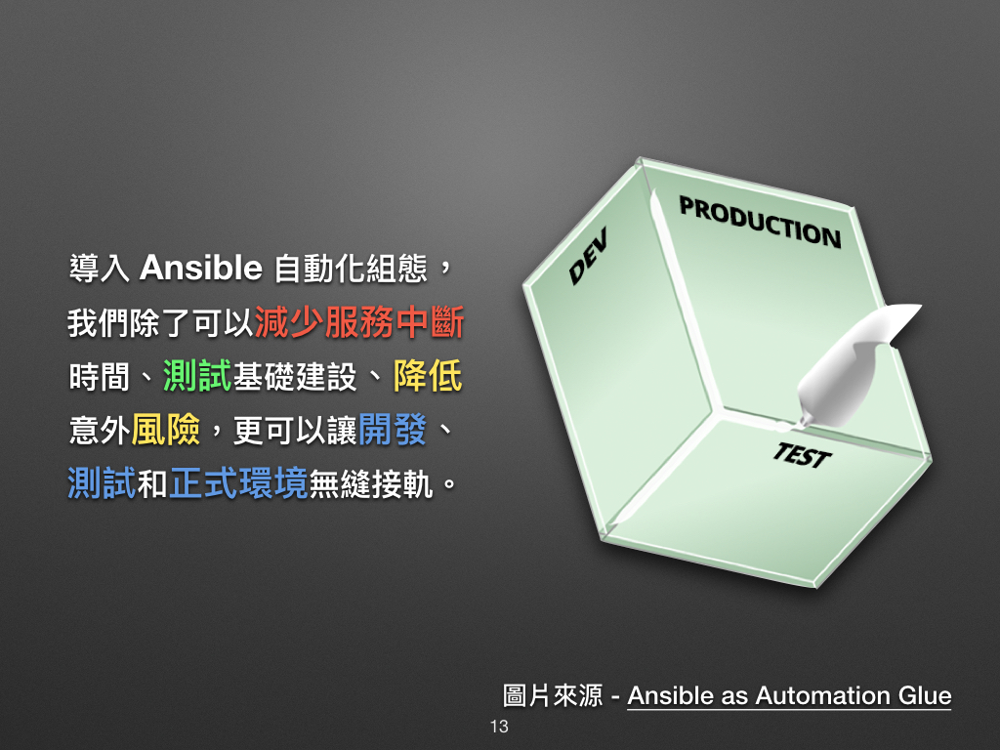
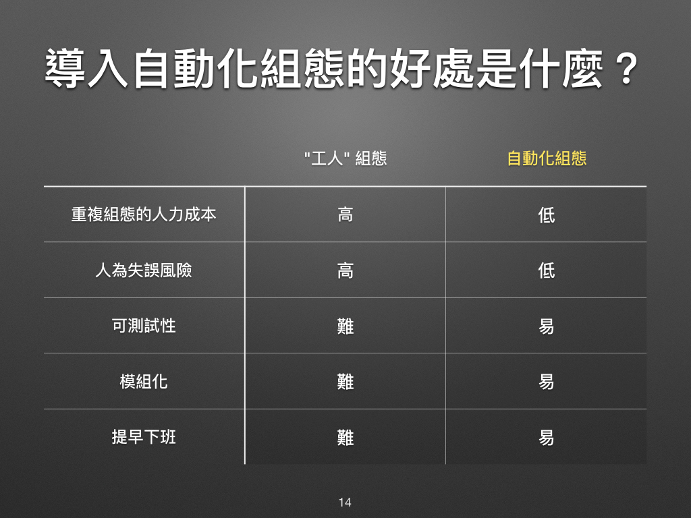

# 現代 IT 人一定要知道的 Ansible 自動化組態技巧

## 01. 前言

凍仁在學時很喜愛[《Unix 與 Linux 自動化管理》](http://www.drmaster.com.tw/Bookinfo.asp?BookID=OS20109)一書，並幻想著有朝一日也能達到自動化管理的境界。但對於 IT 維運者而言，有時間把步驟筆記下來就很難了，更別說是把**安裝 (Setup)**、**部署 (Deploy)**、**安全性更新 (Security Upgrade)** 等步驟寫成可以自動化的 Script！

凍仁從 2015 年末時開始接觸 [**Ansible**](https://ansible.com)，才知道有這麼個比 Shell Script 和 Python 還好用的**組態管理工具 (Configuration management Tool)** [^1]，現在除了會用 Ansible 管公司的機器以外，也透過它處理工作上大大小小的鎖碎事物，相信透過 Ansible 的幫助一定可以讓我們大家都提早下班的。(笑)

本次將沿用凍仁先前的簡報，並藉由圖文並茂的方式彌補[簡報](http://note.drx.tw/2016/05/automate-with-ansible-basic.html)不足的地方。

### 現代 IT 人是什麼？

對於凍仁而言，現代的 IT 人得具備十八般武藝，從**系統規劃**、**部署 (Deployment)**、**開發 (Development)**、**測試 (QA)**、**維運 (Operations)**、**監控 (Monitoring)**、**效能優化 (Performance Optimisation)** 各個階段都得參與的人。

在現代，有個叫「**DevOps**」的名詞概括了不少技能和工具，如 Ansible, Chef, Docker container, Git, Jenkins CI, Vagrant, Zabbix monitoring server … 等，凍仁在此就不多述。(若想深入了解 DevOps 是什麼？[^2] 歡迎加入 [DevOps Taiwan 社團](https://www.facebook.com/groups/DevOpsTaiwan/))

簡而言之，現在的資訊人員 (IT Engineer) 除了要會管機器、管網路、on-call 之外，還得要會寫些自動化的工具來補助自己，不然是難以在下一個世代生存的！

不管是從 Ops 跨到 Dev，還是從 Dev 跨到 Ops，到頭來都是一樣，就看哪邊投的技能點數比較多！

以下是凍仁很喜歡對照表，多年前的凍仁常常耗費不少的時間在**安裝作業系統**、**架設**公司業務所需的大大小小**服務**、寫寫工作日記提醒自己改了什麼設定；如今凍仁會藉由**虛擬化技術**、**雲端運算**和**組態管理工具**等，在相對快速的時間裡完成任務。

寫筆記不如寫工具！更何況還是可重複使用的工具！！

### 導入自動化組態技巧的好處是什麼？

在提好處之前，先來說說凍仁接觸「自動化組態技巧」後的**壞處**有哪些？

1. 學了一套組態工具後就會想用它統一全世界！
2. 得多學習一門技藝，免不了要繼續看文件，而且還要多看 Ansible 的文件。(笑)
3. 會不斷的想把重複的工作自動化，然後丟上 [GitHub](https://github.com/chusiang?utf8=✓&tab=repositories&q=ansible) 和 [Ansible Galaxy](https://galaxy.ansible.com/chusiang/)！

文中提到的組態，其實是從 Configuration management 翻譯過來的。

導入自動化組態工具，除了可以**減少重複性的工作**外，最重要的可以提升**正式環境 (Production)** 的**穩定性**和**可靠性**！

圖片來源 - [Ansible as Automation Glue](https://www.ansible.com/blog/ansible-automation-glue)

當每次的版本釋出 (release)、部署 (deployment) 都會出現不可預測的問題時，將會冒出許多例外工作，這將會大幅度拖累我們的工作進度。

養兵千日用在一時，當我們準備好，就可以在很短的時間內對正式環境進行部署和維護等變更工作，尤其是半夜 12 才要上線的那種 ...。

還記得那一年，開發者 (Developers) 透過 FTP 手動更新程式，發現臭蟲 (bug) 想退版卻無從下手的慘痛經驗！這不只拖累公司整體的業務，還引起了顧客的不滿。

但其實這些問題都是可以事先避免的！只要透過自動化組態工具事先配置好這些變更，搭配版本控制系統和測試，就能有解決這類的問題發生了！

### 資料來源

* [「Ansible 自動化組態管理實戰講堂」與「自我實現」 | 凍仁的筆記](http://note.drx.tw/2016/03/ansible-workshop-and-self-realization.html)
* [現代 IT 人一定要知道的 Ansible 自動化組態技巧 | 凍仁的筆記](http://note.drx.tw/2016/05/automate-with-ansible-basic.html)

[^1]: 組態管理工具 (Configuration management Tool) 一般我們會簡稱為 CM Tool，而在業界我們還會用 [Infrastructure as Code (IaC)](https://en.wikipedia.org/wiki/Infrastructure_as_Code) 的字眼來形容這些工具。

[^2]: 隔壁棚的 Miles 有專門撰寫篇[什麼是 DevOps？](http://ithelp.ithome.com.tw/articles/10184557)的文章，不仿也參考一下喔。