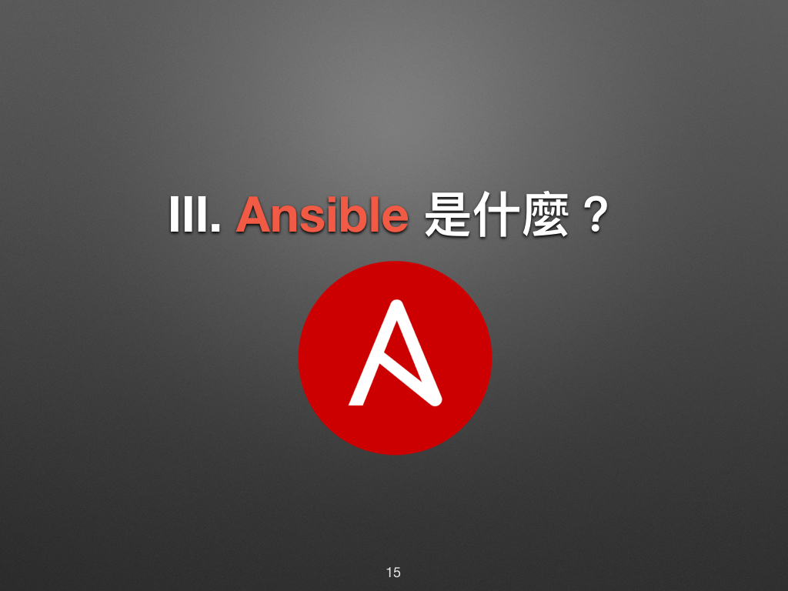
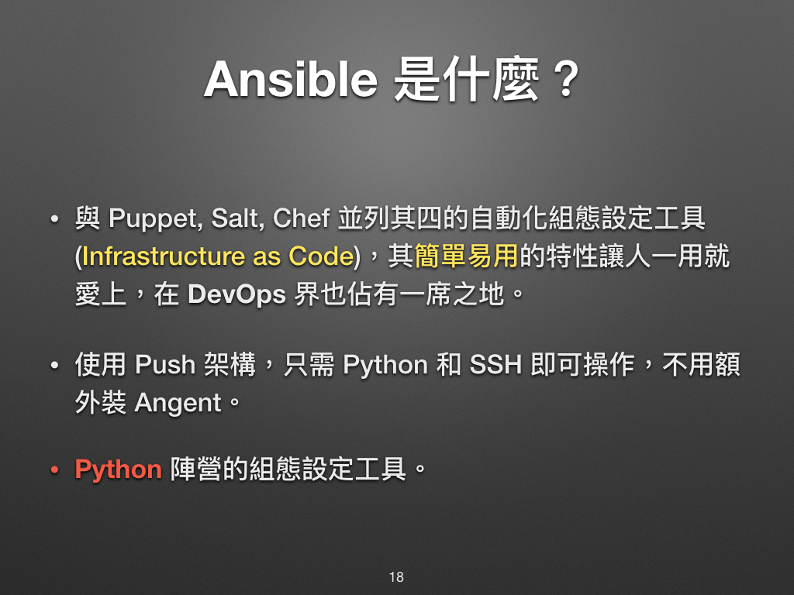

# 現代 IT 人一定要知道的 Ansible 自動化組態技巧

## 02. Ansible 是什麼？

在凍仁解說之前，先來聽聽大家認為的 Ansible 是什麼。

### Ansible 的命名由來？

此名取自 Ansible 作者最喜愛的[《安德的遊戲》][enders_game][^1] 小說，而這部小說更被後人改編成電影 －《戰爭遊戲》。[^2]

大家或許早在電影中就已看過[**安塞波 (Ansible)**][ansible_enders_game_wiki]，它是虛構的超光速通訊裝置。片中主角安德 (Ender) 和他的伙伴們透過 Ansible 跨越時空指揮無數的戰艦，就好比我們操控海量的遠端伺服器一樣。

[ansible_enders_game_wiki]: http://enderverse.wikia.com/wiki/Ansible
[enders_game]: https://zh.wikipedia.org/zh-tw/安德的游戏

### 前人怎麼說 Ansible？

摘至[《奔跑吧 Ansible》][ansiblebook_china]第 ix 頁的推薦序二。

[ansiblebook_china]: http://www.phei.com.cn/module/goods/wssd_content.jsp?bookid=44223

> 維運自動化工具本來是用來簡化維運工作的，但如果工具本身比較複雜，甚至需要一定的程式開發能力，就會增加使用和推廣的難度。Ansible 有三個最吸引人的地方：無客戶端、簡單易用和日誌集中控管。
>
> Ansible 很簡單，上手方便，不需要啃一本很大本的書才能學會使用 (從這一點來看，這可謂業界良心)。
>
> － 蕭田國 (開放運維聯盟聯合主席，高效運維社區發起人)

摘至[《奔跑吧 Ansible》][ansiblebook_china]第 xxiii 頁的原書推薦序。

> 我希望自動化的事情盡快完成，這樣我就能有更多時間投入在我更該關注的事情上面。Ansible 並不是一個你需要整天和它打交道的系統。你可以很快地把它拿起來，很快地搞定，然後又很快地回到你更該關心的事情上面。
>
> 我希望這些也會成為你喜歡 Ansible 的原因。
>
> － Michael DeHaan (Ansible 軟體的創作者，Ansible, Inc. 前 CTO)

摘至 [Red Hat 併購 DevOps 新秀 Ansible | iThome][ansible_ithome] 一文。

[ansible_ithome]: http://www.ithome.com.tw/news/99354

### 凍仁心中的 Ansible 又是什麼？

1. **Python 陣營的組態管理工具**！個人對 Python 熟悉度大於 Ruby。[^3]
2. 不用幫每台機器 (instance) 預載 agent [^4]，只要有 SSH 和 Python 就可以闖天下！
3. 在台灣的市佔率較高 [^5]：找得到前人可以問，甚至還有[工作坊 (workshop)][ansible_workshop] 的課可以聽！
4. 在目前 4 大主流的組態管理工具 (Puppet, SaltStack, Chef, Ansible) 中， Ansible 是最容易上手，且馬上就可以用的工具。(自己說)

[ansible_workshop]: http://devopssummit.ithome.com.tw/workshop/ansible/

### 使用 Ansible 需要具備什麼基礎知識？

1. 具備 Linux 伺服器 (server) 基礎操作和管理經驗。
2. 會使用 ssh 遠端連線至 server。
3. 知道基本的標準輸入 (stdin) 輸出 (stdout) 等觀念。[^6]
4. 會安裝 Linux 套件。[^7]
4. 知道 `sudo` 指令在做什麼，並且會使用它。[^8]
5. 知道什麼是檔案權限，並且會修改它。
6. 知道如何啟用和停止系統服務 (Daemon / Service)。
7. 會撰寫簡易的腳本 (Script)。

您已成功踏入 Ansible 的大門，恭喜你！

### 相關連結

* [「Ansible 自動化組態管理實戰講堂」與「自我實現」 | 凍仁的筆記](http://note.drx.tw/2016/03/ansible-workshop-and-self-realization.html)
* [現代 IT 人一定要知道的 Ansible 自動化組態技巧 | 凍仁的筆記](http://note.drx.tw/2016/05/automate-with-ansible-basic.html)
* [《奔跑吧 Ansible》 | 電子工業出版社][ansiblebook_china]

[^1]: 戰爭遊戲，又名安德的遊戲 (Ender's Game)，是「奧森·斯科特·卡德」最著名的科幻小說，曾在 2013 年於大銀幕上映。 

[^2]: Ansible 命名的由來可參考[《奔跑吧 Ansible》][ansiblebook_china]和 [Ansible FAQ | Ji ZHANG's Blog](http://shzhangji.com/blog/2013/06/11/ansible-faq/) 一文。凍仁早在 2013 年就在電影院的大銀幕上看過 Ansible，但一直到了 2016 年才真正的了解它。

[^3]: 組態管理工具要怎麼選？依據分類帽大概可分粗分為 Python 學院 (Ansible, SaltStack) 和 Ruby 學院 (Chef, Puppet)。

[^4]: 就業務面而言，有時的環境是不容許安裝 agent 的。

[^5]: 在 2016/11/23 的 [DevOps Taiwan Meetup #3 - 配置管理工具大亂鬥 (CM 大亂鬥)][devops_meetup3_cm_tools] 活動裡，Ansible 是現場最多人使用的組態管理工具！

[devops_meetup3_cm_tools]: http://devops.kktix.cc/events/meetup3-cm-tools-96091c

[^6]: 標準輸入輸出可參考 [STDIN、STDOUT、STDERR 與 Bash Redirection 測試 - Tsung's Blog][stdin_stdout_stderr] 一文。

[stdin_stdout_stderr]: https://blog.longwin.com.tw/2013/03/stdin-stdout-stderr-redirection-2013/

[^7]: 套件管理可參考 [[完全用 GNU/Linux 工作] 04. 套件管理 | 凍仁的筆記][package-management]一文。

[package-management]: http://note.drx.tw/2013/09/working-with-linux-04-package-management.html 

[^8]: sudo 可參考 [sudo 指令使用說明 | 凍仁的筆記](http://note.drx.tw/2008/01/linuxsudo.html) 一文。

