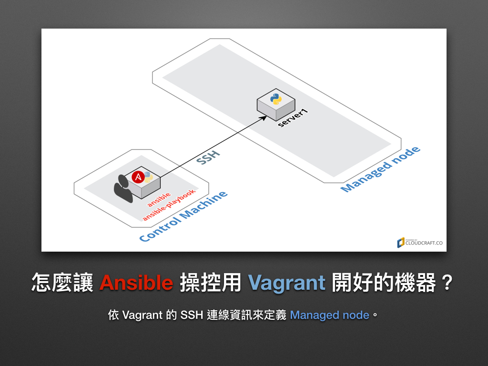

# 現代 IT 人一定要知道的 Ansible 自動化組態技巧

## 04. 怎麼用 Vagrant 練習 Ansible？

在使用 Ansible 的同時，我們可以用 [Vagrant][vagrant_official] 這套純文字工具來管理本機的虛擬機器，透過它我們可以很快速的建立開發和測試的虛擬環境。

[vagrant_official]: https://www.vagrantup.com/


光是可以省下在虛擬機安裝作業系統 (Operation System) 和 OpenSSH server 的時間，就足夠我們使用它了！更別說還可以用它來設定虛擬機的記憶體 (RAM) 大小、網路配置等等。


### 怎麼安裝 Vagrant？

請先安裝最新版的 [Virtualbox][download_virtualbox] 和 Extension Pack，之後再安裝 [Vagrant][download_vagrant] 即可。這裡凍仁將不會特別介紹怎麼安裝 Vagrant，若有什麼問題還請參考以下文章。

- [Installing Vagrant | Vagrant by HashiCorp][Installing_vagrant]
- [研發者的虛擬機寶盒 | Software Architecture School][vm-for-devops]

[download_virtualbox]: https://www.virtualbox.org/wiki/Downloads
[download_vagrant]: https://www.vagrantup.com/downloads.html
[Installing_vagrant]: https://www.vagrantup.com/docs/installation/
[vm-for-devops]: http://school.soft-arch.net/p/vm-for-devops


### 怎麼用 Vagrant 管理虛擬機器？

這裡凍仁只簡單地列出本次主題相關指令，練習時只需執行步驟 1, 2 即可。

1. 建立 Ubuntu 14.04 的 `Vagrantfile` 設定檔。

  ```
  $ vagrant init ubuntu/trusty64
  ```

2. 建立虛擬機器並開啟機器。

  ```
  $ vagrant up
  ```

3. 關閉機器。

  ```
  $ vagrant halt
  ```

4. 重新開機。

  ```
  $ vagrant reload
  ```

5. SSH 遠端連線。

  ```
  $ vagrant ssh
  ```

6. 移除虛擬機器。

  ```
  $ vagrant destroy
  ```


### 怎麼讓 Ansible 操控用 Vagrant 開好的機器？

接下來，我們將會用 Ansible 來控制 Vagrant 在本機上建立的虛擬機，其作業系統版本為 [Ubuntu 14.04 64-bit (AMD64)][ubuntu_14.04_image]。

[ubuntu_14.04_image]: http://releases.ubuntu.com/14.04/



1. 取得虛擬機的 OpenSSH 設定：請特別留意 `HostName`、`User`、`Port` 還有 `IdentityFile` 的值。

  ```
  $ vagrant ssh-config
  Host default
    HostName 127.0.0.1
    User vagrant
    Port 2222
    UserKnownHostsFile /dev/null
    StrictHostKeyChecking no
    PasswordAuthentication no
    IdentityFile /home/jonny/vcs/4.docs/automate-with-ansible/.vagrant/machines/default/virtualbox/private_key
    IdentitiesOnly yes
    LogLevel FATAL
  ```

2. 設定 **ansible.cfg**：`remote_user` 和 `private_key_file` 的設定分別對應 ssh-config 的 `User` 和 `IdentityFile`。

  ```
  $ vi ansible.cfg
  [defaults]

  inventory = hosts
  remote_user = vagrant
  private_key_file = .vagrant/machines/default/virtualbox/private_key
  host_key_checking = False
  ```

2. 設定 **hosts**：`ansible_ssh_host` 和 `ansible_ssh_port` 的設定分別對應 ssh-config 的 `HostName` 和 `Port`。

  ```
  $ vi hosts
  server1  ansible_ssh_host=127.0.0.1  ansible_ssh_port=2222

  [local]
  server1
  ```


### Hello World on Vagrant

當已上的設置都完成了，我們就可以在終端機裡用 Vagrant 建立好的虛擬機來練習 Ansible 了！

```
$ ansible all -m command -a 'echo Hello World on Vagrant.'
server1 | SUCCESS | rc=0 >>
Hello World on Vagrant.
```


### 後語

其實凍仁一直很掙扎要不要寫這次的「怎麼用 Vagrant 練習 Ansible？」主題，因為虛擬環境的替代品真的很多！可又因為 Vagrant 實在是太好用了，所以還是不小心的提筆了。

就實戰面來說，凍仁還是以 Vagrant 所建立出來虛擬環境為主要開發 Ansible Playbooks 的環境，因為它真的很方便，而且模擬出來的環境最擬真！


### 相關連結

- [研發者的虛擬機寶典 | Software Architecture School](http://school.soft-arch.net/courses/vm-for-devops)
- [Vagrant box ubuntu/trusty64 | Atlas by HashiCorp](https://atlas.hashicorp.com/ubuntu/boxes/trusty64)
- [sandbox/ansible · chusiang/sandbox | GitHub](https://github.com/chusiang/sandbox/tree/develop/ansible)
- [[Day 02] Vagrant 介紹 | 30 天入門 Ansible 及 Jenkins-CI](http://ithelp.ithome.com.tw/articles/10184824)
- [[Day 03] Vagrant 基本設定 | 30 天入門 Ansible 及 Jenkins-CI](http://ithelp.ithome.com.tw/articles/10184915)

