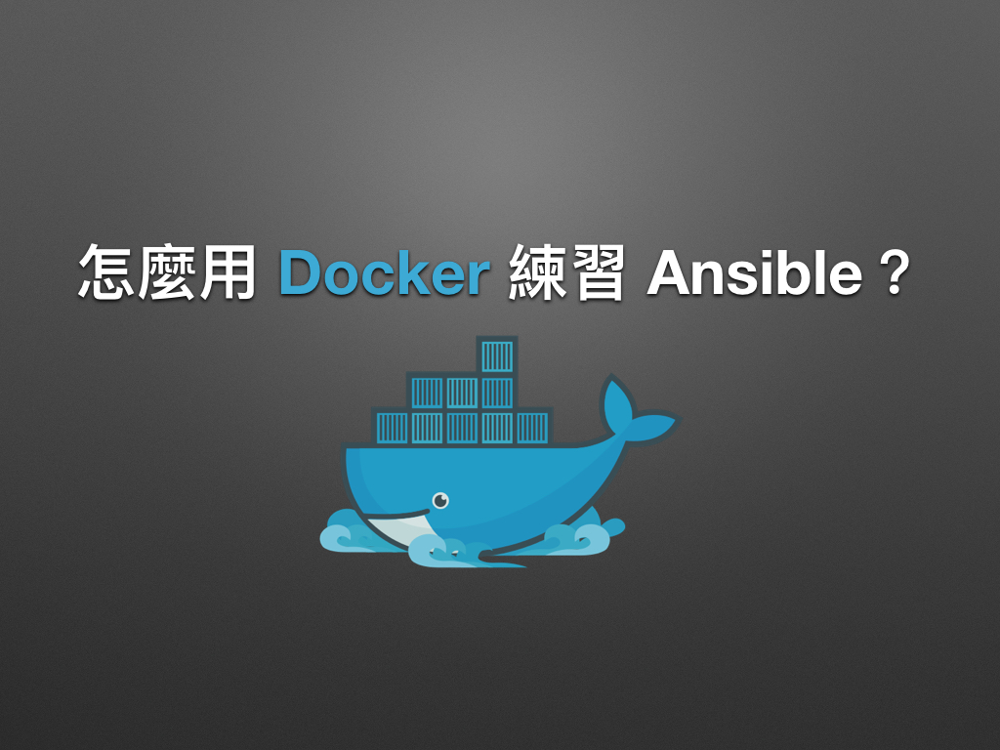
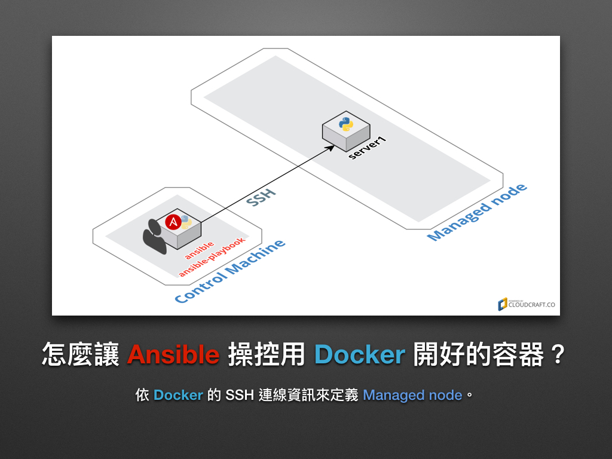

# 現代 IT 人一定要知道的 Ansible 自動化組態技巧

## 05. 怎麼用 Docker 練習 Ansible？

在前一章「[04. 怎麼用 Vagrant 練習 Ansible？](04.how-to-practive-ansible-with-vagrant.md)」我們是使用 Virtualbox + Vagrant 的組合來練習 Ansible，這次凍仁將會改用當前最火紅的 [Docker][docker_official] 虛擬化容器技術來建置虛擬環境。

[docker_official]: https://www.docker.com



Docker 的好凍仁在此就不多談，大家若對 Docker 還不熟悉，可以看看凍仁以前分享過的「[前端工程師一定要知道的 Docker 虛擬化容器技巧][virtualization-with-docker-container]」簡報，這是一份讓人快速上手 Docker 的教學。

[virtualization-with-docker-container]: http://note.drx.tw/2016/07/virtualization-with-docker-container-basic-for-f2e.html


### 怎麼安裝 Docker？

請安裝最新版的 Docker 即可。這裡凍仁將不會特別介紹怎麼安裝，請參考以下文章。

- [Docker 官方網站][docker_ products]。
- [於 Ubuntu 14.04 安裝 Docker 1.9.1+ | 凍仁的筆記][install-docker-191-on-ubuntu-1404]
- [在 OSX 10.11.4 安裝 Docker for Mac (v1.11.0-beta8) | 凍仁的筆記][setup-native-docker-for-mac]

[docker_ products]: https://www.docker.com/products/docker#/
[install-docker-191-on-ubuntu-1404]: http://note.drx.tw/2016/01/install-docker-191-on-ubuntu-1404.html
[setup-native-docker-for-mac]: http://note.drx.tw/2016/05/setup-native-docker-for-mac-v1.11-and-migrate-docker-toolbox-on-osx-10.11.4.html


### 怎麼用 Docker 管理容器 (Container)？

凍仁已在 Docker Hub 上建好了 Managed Node 的 Docker image － [`chusiang/ansible-managed-node`][ansible_managed_node] 以利大家練習 Ansible，該專案目前支援的 Linux 發行版本有：

- `alpine-3.4` (End-of-life, EOL)
- `alpine-3.6`, `latest`
- `archlinux`
- `centos-6`
- `centos-7`
- `debian-7`
- `debian-8`
- `gentoo` (EOL)
- `opensuse-42.1` (EOL)
- `opensuse-42.2`
- `opensuse-42.3`
- `ubuntu-14.04`
- `ubuntu-16.04`

[ansible_managed_node]: https://hub.docker.com/r/chusiang/ansible-managed-node/

底下將列出本次主題所會用到的相關指令，練習時只需執行步驟 1, 2, 3 即可。

1. 取得凍仁事先建立好的 Docker image。

   ```
   $ docker pull chusiang/ansible-managed-node:ubuntu-14.04

   #### 使用者帳戶 #####################
   #
   # |           | username | password |
   # |-----------|----------|----------|
   # | root user | root     | root     |
   # | sudo user | docker   | docker   |
   ```

2. 建立並執行容器。

   ```
   $ docker run --name server1 -d -P chusiang/ansible-managed-node:ubuntu-14.04
   ecdf39055ba2a932fa8c76a75afdec1cd8f516285bee6f4e07c16c67f4009211
   ```

3. 觀看容器狀態和 SSH 綁定的埠口 (Port)。

   ```
   $ docker ps
   CONTAINER ID        IMAGE                                        COMMAND                  CREATED             STATUS              PORTS              NAMES
   ecdf39055ba2        chusiang/ansible-managed-node:ubuntu-14.04   "/usr/sbin/sshd -D"      20 hours ago        Up 17 seconds       0.0.0.0:32805->22/tcp    server1
   ```

4. 進入容器。

   ```
   $ docker exec -it server1 bash
   ```

5. 關閉容器。

   ```
   $ docker stop server1
   ```

6. 啟用容器。

   ```
   $ docker start server1
   ```

7. 移除容器。

   ```
   $ docker rm server1

   # -f, --force: 強制移除，包含正在執行的容器。
   ```


### 怎麼讓 Ansible 操控用 Docker 開好的容器？

接下來，我們將會用 Ansible 來控制 Docker 在本機上建立的容器，其作業系統版本為 Ubuntu 14.04 64-bit (AMD64)，大家可以從 [Dockerfile][ubuntu_14.04_image] [^1] 看到裡面已預載了 OpenSSH server 和 Python。

[ubuntu_14.04_image]: https://github.com/chusiang/ansible-managed-node.dockerfile/blob/master/ubuntu-14.04/Dockerfile



1. 取得容器的 OpenSSH 設定：請特別留意 `0.0.0.0:32805->22/tcp` 的值。

   ```
   $ docker ps
   CONTAINER ID        IMAGE                                        COMMAND                  CREATED             STATUS              PORTS              NAMES
   ecdf39055ba2        chusiang/ansible-managed-node:ubuntu-14.04   "/usr/sbin/sshd -D"      20 hours ago        Up 17 seconds       0.0.0.0:32805->22/tcp    server1
   ```

2. 設定 **ansible.cfg**：將 `remote_user` 設為 `docker`。

   ```
   $ vi ansible.cfg
   [defaults]

   inventory = hosts
   remote_user = docker
   host_key_checking = False
   ```

3. 設定 **hosts**。

   ```
   $ vi hosts
   server1  ansible_ssh_host=127.0.0.1  ansible_ssh_port=32805 ansible_ssh_pass=docker

   [local]
   server1
   ```

   1. `ansible_ssh_host`：請設為本機的 IP。
   2. `ansible_ssh_port`：請設為 `docker ps` 時取得的 SSH port。
   3. `ansible_ssh_pass`：因沒有連線用的 SSH 金鑰，故直接使用密碼的方式進行連線，**建議只於練習環境使用**該參數。


### Hello World on Docker

當已上的設置都完成了，我們就可以在終端機裡用 Docker 建立好的容器來練習 Ansible 了！

```
$ ansible all -m command -a 'echo Hello World on Docker.'
server1 | SUCCESS | rc=0 >>
Hello World on Docker.
```


### 後語

就實務面而言，凍仁一般會先在 Vagrant 的虛擬環境先開發好 Ansible Playbooks，有 Dockerize 需求再來相容 Docker 的環境。

Vagrant 利於開發，而 Docker 利於散佈、部署和節省資源，要怎麼搭配使用就看個人的習慣了。


### 相關連結

- [前端工程師一定要知道的 Docker 虛擬化容器技巧 | 凍仁的筆記][virtualization-with-docker-container]
- [Welcome to the Docs | Docker Docs][docker_docs]

[docker_docs]: https://docs.docker.com/


[^1]: `chusiang/ansible-managed-node:ubuntu-14.04` image  的 Dockerfile 可以在凍仁的 GitHub 找到，其網址為 https://github.com/chusiang/ansible-managed-node.dockerfile/blob/master/ubuntu-14.04/Dockerfile 。

