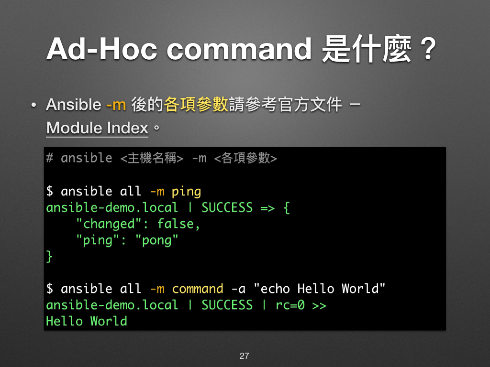
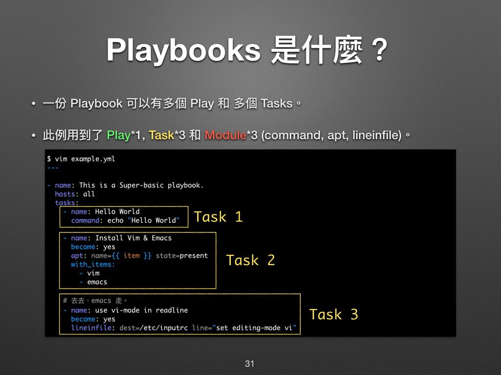

# 現代 IT 人一定要知道的 Ansible 自動化組態技巧

## 06. 怎麼操作 Ansible？

相信大家手邊都有可以練習 Ansible 的環境了，今次凍仁就來談談怎麼操作 Ansible！

 一般來說，我們可以用 Ad-Hoc command 和 Playbook 兩種方式來操作 Ansible。

如果今天只能記住一件事，請記住 Ansible 最好用、最厲害的就是它的 Playbook 了！

### Ad-Hoc command 是什麼？

**Ad hoc** 是拉丁文常用短語中的一個短語，通常用來形容為一個特定的問題或任務而專門設定的解決方案 [^1]。在這裡則是代表**指令操作模式**。

以常見的 `ping` 和 `echo` 為例來比較一下 Linux Shell [^2] 和 Ansible 的執行結果。

- Shell

      $ ping ansible.demo.local
      $ echo Hello World

    

- Ansible

      $ ansible all -m ping
      $ ansible all -m command -a "echo Hello World"

    

### Playbook 是什麼？

相信大家都會 Ansible 了 ！ ...

前者是透過一次次簡短的指令來操作 Ansible，而後者則是先把任務寫好，然後再一次執行。兩者的關係就好比我們在 Linux Shell 裡打指令和先寫個 Shell Script 再執行一樣。

### 資料來源

* [凍仁的筆記: 現代 IT 人一定要知道的 Ansible 自動化組態技巧](http://note.drx.tw/2016/05/automate-with-ansible-basic.html)

[^1]: 詳情請參考維基百科上的 [Ad hoc][ad_hoc_wikipedia] 解釋。

[ad_hoc_wikipedia]: https://zh.wikipedia.org/wiki/Ad_hoc

[^2]: Linux Shell，是我們一般在 GNU/Linux 上操作的模式，而常見的 Shell 有 Bash, Zsh ... 等，在 Windows 上則有命令提示字元 (CMD)，但它對使用者而言沒有 Shell 友善。

