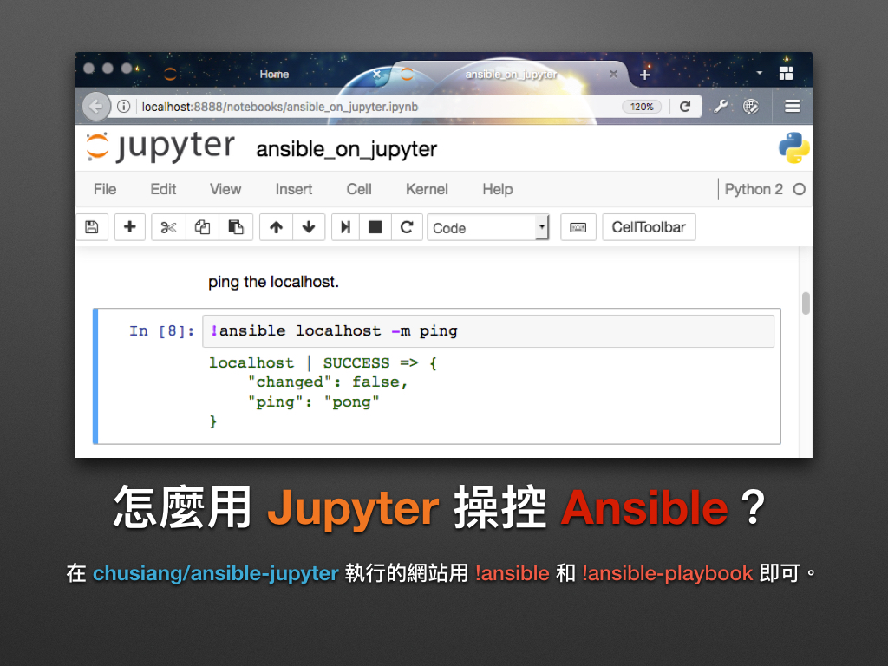
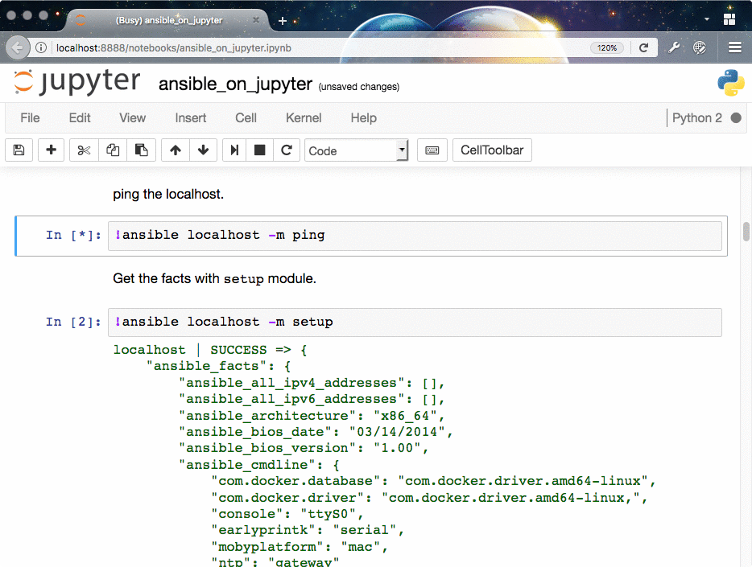

# 現代 IT 人一定要知道的 Ansible 自動化組態技巧

## 07. 怎麼用 Jupyter 操控 Ansible？(localhost)

在「[05. 怎麼用 Docker 練習 Ansible？](05.how-to-practive-ansible-with-docker.md)」一章時，凍仁用了 Docker 來練習 Ansible，而這次凍仁將再次結合 Jupyter 這套系統來使用 Ansible。


### Jupyter 是什麼？

[Jupyter][jupyter_official] 的全名為 Jupyter Notebook，是從 2014 年的 iPython 專案演變而來的。它是個可以透過網頁來撰寫**可互動式**的文件系統，除了支援 Markdown, Python 和 (幾乎) 所有的程式語言外，還可以在上面執行 Shell 指令！

官網簡介如下：
 
> The Jupyter Notebook is a web application that allows you to create and share documents that contain live code, equations, visualizations and explanatory text.

[jupyter_official]: http://jupyter.org

若想深入了解 Jupyter，可參考以下文章：

- [Jupyter 簡介 — 互動式的筆記本系統 by mutolisp | SlideShare][jupyter_mutolisp_slides]
- [Jupyter Notebook 快速入門（上）\| 編程派 (Coding Python)][getting_started_with_jupyter1]
- [Jupyter Notebook 快速入門（下）\| 編程派 (Coding Python)][getting_started_with_jupyter2]

[jupyter_mutolisp_slides]: http://www.slideshare.net/mutolisp/jupyter
[getting_started_with_jupyter1]: http://codingpy.com/article/getting-started-with-jupyter-notebook-part-1/
[getting_started_with_jupyter2]: http://codingpy.com/article/getting-started-with-jupyter-notebook-part-2/

> 現在連 [Microsoft Azure][azure_official] 都推出了 [Notebooks][azure_notebooks] 的 SaaS 服務在搶攻 Jupyter 的市場，得以證實它受歡迎程度非常之高。

[azure_official]: https://azure.microsoft.com/zh-tw/
[azure_notebooks]: https://notebooks.azure.com/


### 怎麼用 Jupyter 操控 Ansible？

凍仁已建好了作為 **Control Machine** 的 **Jupyter** Docker image － [`chusiang/ansible-jupyter`][ansible_jupyter]，大家可從 Docker Hub 上取得。目前支援的 Linux 發行版本有：

- `alpine-3.4` (End-of-life, EOL)
- `alpine-3.6`, latest
- `archlinux`
- `centos-7`
- `debian-7`
- `debian-8`
- `gentoo` (EOL)
- `opensuse-42.1` (EOL)
- `opensuse-42.2`
- `opensuse-42.3`
- `ubuntu-14.04`
- `ubuntu-16.04`

[ansible_jupyter]: https://hub.docker.com/r/chusiang/ansible-jupyter/



1. 在終端機 (Terminal) 裡啟動 Jupyter 的容器，請依個人喜好選擇 image，其 `latest` 標籤 (tag) 是對應到 `alpine-3.4`。

   ```
   # alpine-3.4
   $ docker run -p 8888:8888 -d chusiang/ansible-jupyter:alpine-3.4

   # ubuntu-14.04
   $ docker run -p 8888:8888 -d chusiang/ansible-jupyter:ubuntu-14.04
   ```

2. 查看容器狀態，並確認剛剛啟動的 Jupyter 容器是有否綁定 Port 到 8888 上。

   ```
   $ docker ps
   CONTAINER ID        IMAGE                                        COMMAND                  CREATED             STATUS              PORTS                    NAMES
   4c5e92f73db8        chusiang/ansible-jupyter:ubuntu-14.04        "docker-entrypoint.sh"   44 hours ago        Up 3 seconds        0.0.0.0:8888->8888/tcp   naughty_elion
   ```

3. 於瀏覽器輸入 http://localhost:8888/ 進入 Jupyter 網站。
4. 開啟 `ansible_on_jupyter.ipynb` 檔案。
5. 試著在 Jupyter 上操控 Ansible 吧！

   

6. 在 Jupyter 上要執行 Shell 指令時，記得要在開頭加上 `!` 的前綴字元。
7. 在 Code Block 輸入完指令後，點擊選單列的 **▶▏**或使用 `<Ctrl>` + `<Enter>` 的快捷鍵即可執行。
8. 練習完，記得下載這本 notebook (透過左上角的 `File` 選單裡有 `Download as` 的項目進行下載)，不然一旦等容器被移除該筆記就沒了！
9. 現在的環境其實只有 Control Machine 一台，所以 inventory 的設定只有 `localhost` 有作用！

   


### 後語

最早凍仁是從 [@sakanamax][sakanamax] 前輩身上得知 Ansible + Jupyter 這個超棒的組合，並透過它們入門 Ansible 這項技藝！

在 2016 年第 8 屆鐵人賽開賽前夕，凍仁便嘗試把這個組合移植到更多的 GNU/Linux 發行版本上，前後約花了 2 週才完成呢。

最後希望 `chusiang/ansible-jupyter` 這個 Docker image 可以幫助到大家入門 Ansible。:D

[sakanamax]: https://twitter.com/sakanamax


### 相關連結

- [Jupyter 官方網站][jupyter_official]
- [`chusiang/ansible-jupyter` | Docker Hub][ansible_jupyter]
- [前端工程師一定要知道的 Docker 虛擬化容器技巧 | 凍仁的筆記][virtualization_with_docker]

[virtualization_with_docker]: http://note.drx.tw/2016/07/virtualization-with-docker-container-basic-for-f2e.html

