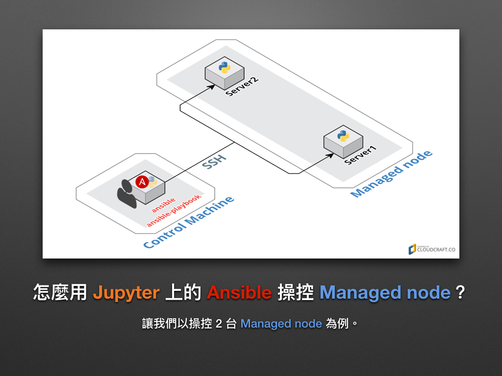
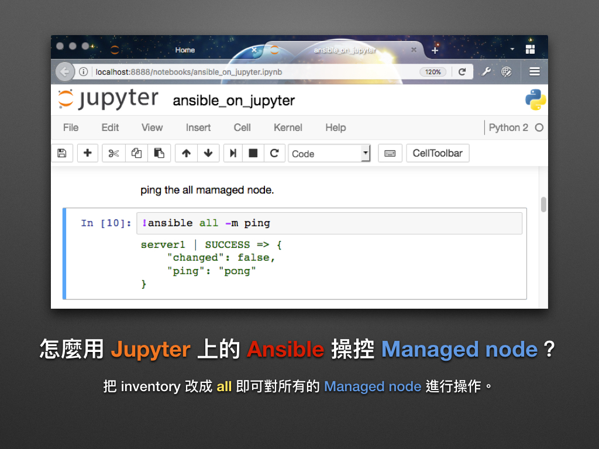
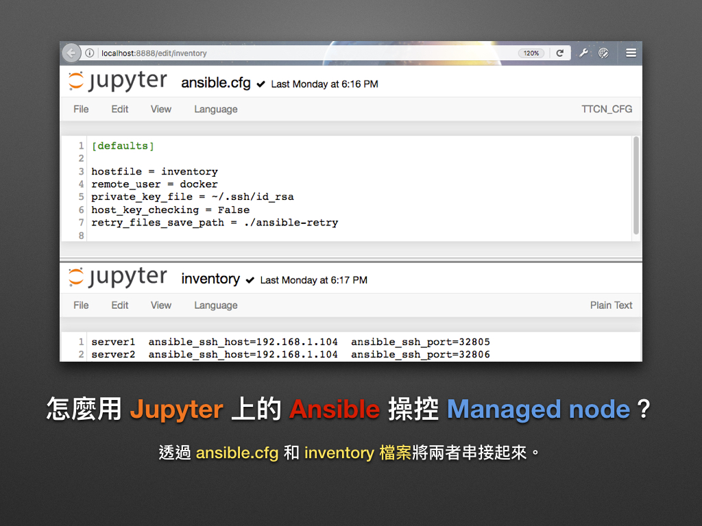
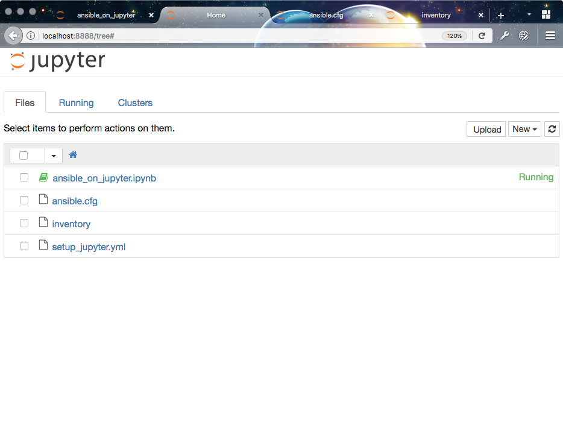
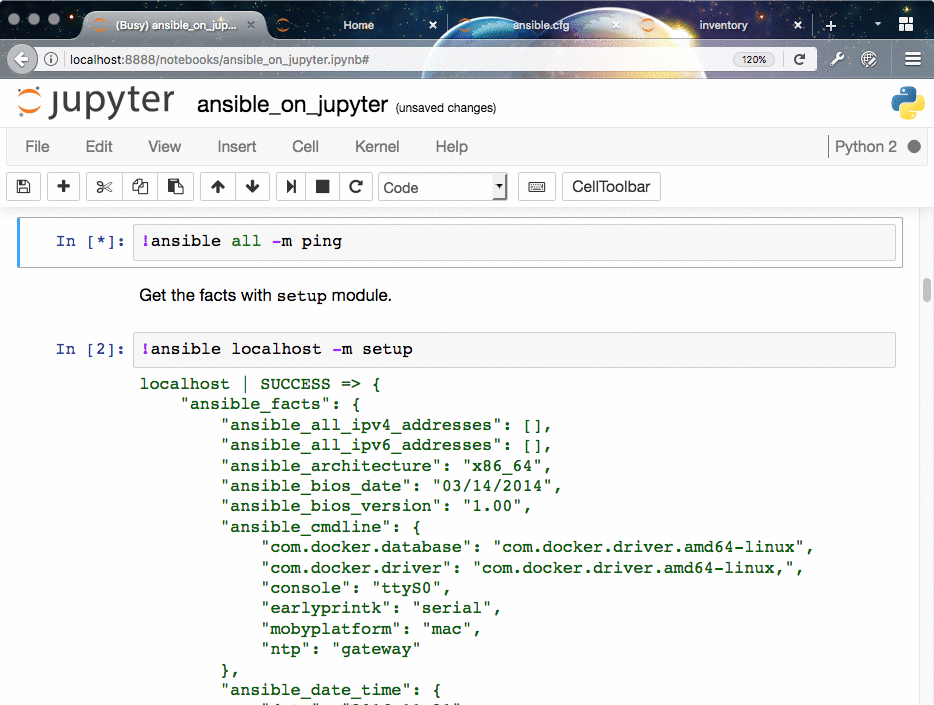

# 現代 IT 人一定要知道的 Ansible 自動化組態技巧

## 08. 怎麼用 Jupyter 操控 Ansible？(Managed node)

在前一章「[07. 怎麼用 Jupyter 操控 Ansible？(localhost)](07.how-to-practive-ansible-with-jupyter1.md)」凍仁用了 Jupyter 來練習 Ansible，那時凍仁只介紹 Ansible 對 Control Machine 對本機進行操控的部份，這次凍仁將透過 Jupyter 和 Ansible 來操控 2 個 Managed node。


### 怎麼用 Jupyter 上的 Ansible 操控 Managed node？

#### 建立 Managed node

使用 [`chusiang/ansible-managed-node`][ansible_managed_node] 的 Docker image 來建立 2 個 Managed node，我們在「[05. 怎麼用 Docker 練習 Ansible？](05.how-to-practive-ansible-with-docker.md)」的章節有說明過，在此就不多加敘述。

[ansible_managed_node]: https://hub.docker.com/r/chusiang/ansible-managed-node/



1. 啟動 server1 的 Managed node，其 OS 版本為 Ubuntu 14.04。

  ```
  $ docker run --name server1 -d -P chusiang/ansible-managed-node:ubuntu-14.04
  ```

1. 啟動 server2 的 Managed node，其 OS 版本為 CentOS 7。

  ```
  $ docker run --name server2 -d -P chusiang/ansible-managed-node:centos-7
  ```


#### 建立 Control Machine

請參考前一章「[07. 怎麼用 Jupyter 操控 Ansible？(localhost)](07.how-to-practive-ansible-with-jupyter1.md)」，使用 [`chusiang/ansible-jupyter`][ansible_jupyter] 的 Docker image 建立 Control Machine 容器，已建立該容器者請略過此步驟。



- 啟動 Control Machine，其 OS 版本為 Ubuntu 14.04。

  ```
  $ docker run -p 8888:8888 -d chusiang/ansible-jupyter:ubuntu-14.04
  ```

[ansible_jupyter]: https://hub.docker.com/r/chusiang/ansible-jupyter/


#### 設定 Ansible 環境

建好 Control Machine 和 Managed node 的環境後，我們還需透過 `ansible.cfg` 和 `inventory` 檔案將兩者串接起來 (可參考「[03. 怎麼部署 Ansible 環境？ ](03.how-to-deploy-ansible.md)」一章)。



1. 取得本機的 IP：凍仁取得的 IP 為 `192.168.1.104`，請自行修改。

  ```
  # GNU/Linux
  $ ifconfig eth0

  # macOS
  $ ifconfig en7
  ```

2. 取得 Managed node 容器所綁定的 OpenSSH port，請特別留意 `0.0.0.0:*->22/tcp` 的部份。

  ```
  $ docker ps
  CONTAINER ID        IMAGE                                        COMMAND                  CREATED             STATUS              PORTS                    NAMES
  309616808a9e        chusiang/ansible-jupyter:ubuntu-14.04        "docker-entrypoint.sh"   2 days ago          Up 1 seconds        0.0.0.0:8888->8888/tcp   admiring_mccarthy
  89fc4e7cca15        chusiang/ansible-managed-node:centos-7       "/usr/sbin/sshd -D"      2 days ago          Up 51 minutes       0.0.0.0:32806->22/tcp    server2
  ecdf39055ba2        chusiang/ansible-managed-node:ubuntu-14.04   "/usr/sbin/sshd -D"      3 days ago          Up 39 hours         0.0.0.0:32805->22/tcp    server1
  ```

3. 進入 Jupyter notebook 網站 ([http://localhost:8888/][jupyter_website])。

[jupyter_website]: http://localhost:8888/

4. 修改 `ansible.cfg` 檔案。

  ```
  [defaults]
  
  inventory = inventory
  remote_user = docker
  private_key_file = ~/.ssh/id_rsa
  host_key_checking = False
  retry_files_save_path = ./ansible-retry
  ```

5. 修改 `inventory` 檔案，並填入步驟 1 取得的 IP 和步驟 2 取得的 OpenSSH port。

  ```
  server1  ansible_ssh_host=192.168.1.104  ansible_ssh_port=32805
  server2  ansible_ssh_host=192.168.1.104  ansible_ssh_port=32806
  ```

  > 請勿在這個 Lab 使用 localhost 和 127.0.0.1 的位址，這會讓 Control Machine 一直對自己找 Managed node。在這裡我們是把 Managed node 的 OpenSSH port 綁在 Host OS [^1] 上，而不是 Control Machine 的容器裡。

6. 這時 Jupyter 網站底下會有 `ansible_on_jupyter.ipynb`, `ansible.cfg`, `hosts`, `setup_jupyter.yml` 四個檔案。

  


#### Play Ansible

現在我們可以在 Jupyter 上透過 Ansible 操控 2 個 Managed node 了，記得把 inventory 的部份從 `localhost` 改成 `all` 喔！



- 由於 Control Machine 是藉由 `docker` 這個 sudo user 來管理 Managed node，故我們需藉由 `--become` 參數來取得 Managed node 上的 `sudo` 權限。

  ```
  !ansible all -m command -a 'sudo cat /etc/sudoers' --become
  ```


### 後語

終於幫先前辛辛苦苦建置的 `chusiang/ansible-jupyter` 和 `chusiang/ansible-managed-node` 兩個 Docker image 寫了一篇完整的介紹文了！一開始建置時沒想那麼多，沒想到這樣的組合會這麼有威力！現在凍仁不管是要 debug 還是測試不同的 GNU/Linux 都會先拿這兩個 image 來用呢。:P


### 相關連結

- [`chusiang/ansible-jupyter` | Docker Hub][ansible_jupyter]
- [`chusiang/ansible-managed-node` | Docker Hub][ansible_managed_node]
- [前端工程師一定要知道的 Docker 虛擬化容器技巧 | 凍仁的筆記][virtualization_with_docker]

[virtualization_with_docker]: http://note.drx.tw/2016/07/virtualization-with-docker-container-basic-for-f2e.html


[^1]: 在區分實體機器和虛擬機器時，我們常用 Host OS 來稱呼前者，而後者則會用 Guest OS 或 VM 來形容之。

