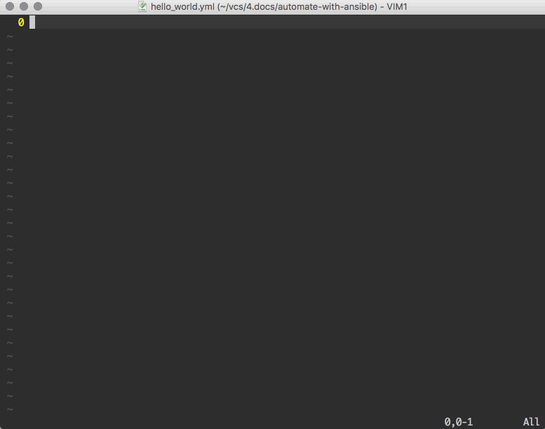
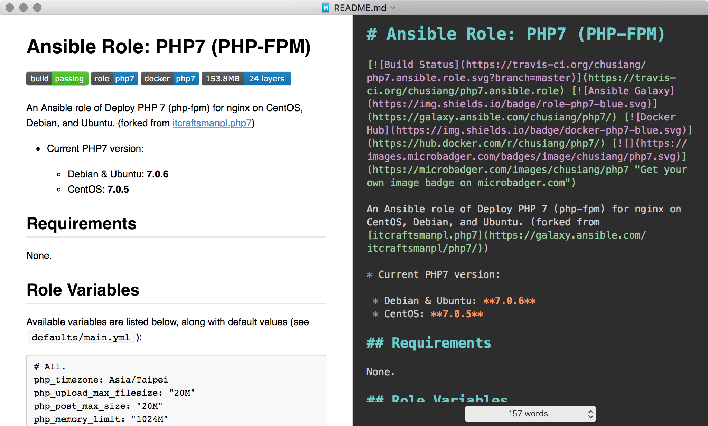
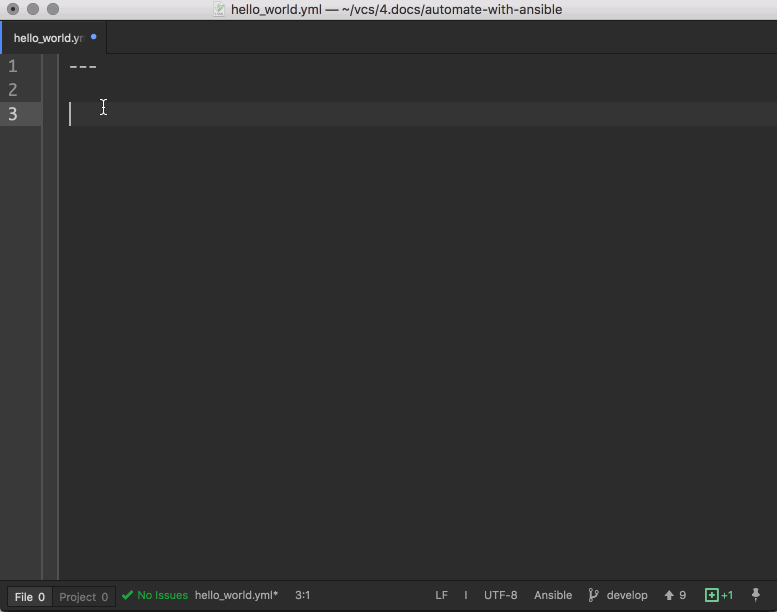
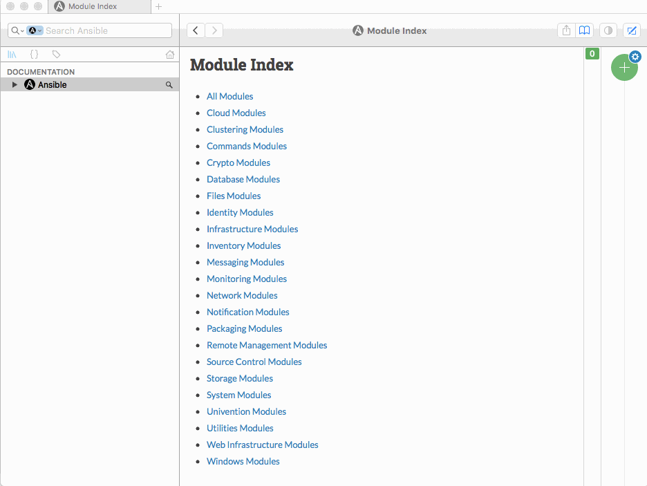
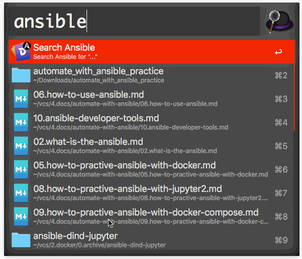

# 現代 IT 人一定要知道的 Ansible 自動化組態技巧

## 10. Ansible 的開發工具有哪些？

在開始撰寫 Ansible Playbooks 前，讓凍仁先來介紹平日會用到的開發工具和相關技巧。


凍仁在「[06. 怎麼操作 Ansible？](06.how-to-use-ansible.md)」一文時早有提到 Playbooks 其實是使用 [YAML][yaml_wikipedia] 的語法在撰寫，雖說我們只要有純文字編輯器就可以進行開發，但凍仁還是會藉由些**自動補齊 (Auto-complete)**、**縮排提示**、**語法 (Syntax) 高亮 (Highlighting)** 和**檢查 (Check)** 等擴充套件工具來補助。

[yaml_wikipedia]: https://zh.wikipedia.org/wiki/YAML


### 純文字編輯器 (Text Editor)

#### Vim

[Vim][vim] 是凍仁多年來主要使用的文字編輯器，不管是編寫程式、文件還是設定檔都是一套打天下，而現在也用它來開發 Playbooks。凍仁自己除了會在 Terminal 使用 Vim 之外，還會額外安裝 GVim (GNU/Linux, Windows) 和 [MacVim][macvim] (macOS) 來使用 Vim。

[vim]: http://www.vim.org/
[macvim]: https://github.com/macvim-dev/macvim


▲ 以上為使用 MacVim 撰寫 Playbooks 的 demo，其 colorscheme 為 [Tomorrow Night Eighties][vim_tomorrow_night_eighties]。

[vim_tomorrow_night_eighties]: https://github.com/chriskempson/vim-tomorrow-theme/blob/master/colors/Tomorrow-Night-Eighties.vim

- [ag.vim][ag.vim]：在 Vim 裡跑 ag 的套件。
- [**ansible-vim**][ansible-vim]：支援 Ansible 檔案 syntax highlighting 的套件。
- [ctrlp.vim][ctrlp.vim]：模糊搜尋檔案的套件。
- [dash.vim][dash.vim]：讓 Vim 整合使用 Dash.app 的套件，但只支援 macOS。
- [EnhCommentify.vim][enhcommentify.vim]：可快速對多行註解和反註解的套件。
- [indentLine][indentline]：使用垂直線顯示縮排提示的套件。
- [neobundle.vim][neobundle.vim]：Vim 的套件管理員，可參考凍仁 3 年前寫過的「[12. Vim 套件管理 - NeoBundle | 完全用 GNU/Linux 工作][working_on_gnu_linux_vim_neobundle]」一文。
- [nerdtree][nerdtree]：在 Vim 裡使用分割視窗開啟檔案管理員的套件。
- [syntastic][syntastic]：支援多種語言的程式碼檢查套件，可另外用 `pip` 安裝 [ansible-lint][ansible-lint] 來檢查 syntax 和 style。
- [vim-gitgutter][vim-gitgutter]：在 Vim 裡觀看 git diff 還有新增修改等狀態的套件。
- [**Vim-Jinja2-Syntax**][vim-jinja2-syntax]：支援 Jinja2 檔案語法高亮的套件。
- [YouCompleteMe][youcompleteme]：自動補齊文字的套件。
- [zeavim.vim][zeavim.vim]：讓 Vim 整合使用 Zeal 的套件。

[ag.vim]: https://github.com/rking/ag.vim
[ansible-lint]: https://github.com/willthames/ansible-lint
[ansible-vim]: https://github.com/pearofducks/ansible-vim
[ctrlp.vim]: https://github.com/kien/ctrlp.vim
[dash.vim]: https://github.com/rizzatti/dash.vim
[enhcommentify.vim]: http://www.vim.org/scripts/script.php?script_id=23
[indentline]: https://github.com/Yggdroot/indentLine
[neobundle.vim]: https://github.com/Shougo/neobundle.vim
[nerdtree]: https://github.com/scrooloose/nerdtree
[syntastic]: https://github.com/vim-syntastic/syntastic
[vim-gitgutter]: https://github.com/airblade/vim-gitgutter
[vim-jinja2-syntax]: https://github.com/Glench/Vim-Jinja2-Syntax
[working_on_gnu_linux_vim_neobundle]: http://ithelp.ithome.com.tw/articles/10131427
[youcompleteme]: https://github.com/Valloric/YouCompleteMe
[zeavim.vim]: https://github.com/KabbAmine/zeavim.vim


##### Syntastic

要讓 Syntastic 可以完整支援 Ansible，我們還需安裝 **ansible-vim** 和 **ansible-lint** 才行。

1. 使用 pip 安裝 ansible-lint。

  ```
  $ sudo pip install ansible-lint
  ```

2. 使用 NeoBundle 安裝 Syntastic 和 ansible-vim，並調整設定。

  ```
  $ vi ~/.vimrc
  ...
  " ansible-vim
  NeoBundle 'pearofducks/ansible-vim'

  " Syntastic
  NeoBundle 'scrooloose/syntastic'
  let g:syntastic_enable_highlighting = 1
  let g:syntastic_always_populate_loc_list = 1
  let g:syntastic_auto_loc_list = 1
  let g:syntastic_check_on_open = 1
  let g:syntastic_check_on_wq = 0

  set statusline+=%#warningmsg#
  set statusline+=%{SyntasticStatuslineFlag()}
  set statusline+=%*

  " ignore files of Ansible Roles.
  let g:syntastic_ignore_files = ['\m^roles/']
  ```

3. Syntastic 的細部設定可從 [GitHub][syntastic] 上找到，特別要提一下的是上面多了**停止檢查 `roles/` 目錄**的設定，在凍仁的習慣裡 Roles 大多會另外維護，這部份在再往後的章節才會多加說明。
4. 如只想用 Syntastic 來檢查語法錯誤 (syntax error) 而不想檢查 style 的話，可把 style 的部份關掉。

  ```
  let g:syntastic_quiet_messages = { "type": "style" }
  ```


#### MacDown

[MacDown][macdown_official] 是 macOS 上 open source 的 Markdown 文字編輯器，凍仁會在撰寫 `README.md` 時會用到，但近來發現 [Livedown][livedown] 這個工具後，就比較常用 Vim 在寫 Markdown 文件了。

> 題外話，凍仁連現在這篇文章都是用 Vim + Livedown 在寫的呢！

[macdown_official]: http://macdown.uranusjr.com
[livedown]: https://github.com/shime/livedown



#### Atom

[Atom][atom_official] 是 GitHub 釋出的 open source 文字編輯器，業界也有不少使用者，凍仁雖不常使用，但它的自動補齊功能非常之強大，若本身沒有在使用 Vim，不妨可以用它來開發 Playbooks。

[atom_official]: https://atom.io


▲ 以上為使用 Atom 撰寫 Playbooks 的 demo，其 UI Theme 為 One Dark，而 Syntax Theme 為 [Tomorrow Night Eighties][atom_tomorrow_night_eighties]。

[atom_tomorrow_night_eighties]: https://atom.io/themes/tomorrow-night-eighties

- [**ansible-snippets**][atom_ansible-snippets]：Snippets for Ansible.
- [**autocomplete-ansible**][atom_autocomplete_ansible]：Ansible 自動補齊的套件。
- [Linter-Ansible-Linting][atom_linter_ansible_linting]：檢查 Ansible 語法的套件，需手動使用 `pip` 安裝 [ansible-lint][ansible-lint]。
- [dash][atom_dash]：讓 Atom 整合使用 Dash.app 的套件，但只支援 macOS。

[atom_ansible-snippets]: https://atom.io/packages/ansible-snippets
[atom_autocomplete_ansible]: https://atom.io/packages/autocomplete-ansible
[atom_linter_ansible_linting]: https://atom.io/packages/linter-ansible-linting
[atom_dash]: https://atom.io/packages/dash


### Terminal (終端機)

在 GNU/Linux 和 macOS 上都已內建 terminal，但凍仁較慣用以下三個 terminal emulator。

- [iTerm2][iterm2]：macOS 上的 Terminal 不二選擇，為了要相容 Terminator 的習慣，凍仁還下了不少功夫調整。
- [Terminator][terminator]：GNU/Linux 上支援畫面分割的 Terminator，是個比 Gnome Terminal 順手的工具。
- [rxvt-unicode][urxvt]：GNU/Linux 上極輕量的 Terminal。

[iterm2]: https://www.iterm2.com
[terminator]: https://gnometerminator.blogspot.tw/p/introduction.html
[urxvt]: http://software.schmorp.de/pkg/rxvt-unicode.html


### 虛擬環境 (Virtual Environment)

- [Docker][docker_official]：凍仁曾在「[05. 怎麼用 Docker 練習 Ansible？](05.how-to-practive-ansible-with-docker.md)」一章題過，在此就不多加說明了。
- [Vagrant][vagrant_official]：凍仁主要開發 Playbook 的環境，曾在「[04. 怎麼用 Vagrant 練習 Ansible？](04.how-to-practive-ansible-with-vagrant.md)」一章題起過。

[docker_official]: https://www.docker.com
[vagrant_official]: https://www.vagrantup.com


### API 文件覽瀏器 (API Documentation Browser)

Ansible 是 2012 才開始的專案，可 Module 的總數已經高達 836 之多，雖說各個 Module 的使用文件在[官網][ansible_all_module]上都查的到，但凍仁還是習慣在本機存一份離線版以備不時之需。

[ansible_all_module]: https://docs.ansible.com/ansible/latest/modules/list_of_all_modules.html

- [Dash][dash_official]：macOS 上查詢、自動更新 API 文件的工具，其 license 為 US$ 24.99。

    

- [Zeal][zeal_official]：open source 版的 Dash，支援 GNU/Linux 和 Windows。
- [DevDocs][devdocs]：網頁版的 Zeal。
- [LovelyDocs][lovelydocs]：Android 上類似 Dash 的離線 API 文件瀏覽器。 [^1]

[dash_official]: https://kapeli.com/dash
[zeal_official]: https://zealdocs.org
[devdocs]: http://devdocs.io/
[lovelydocs]: https://play.google.com/store/apps/details?id=com.lovelyhq.android.lovelydocs

### 其它

- [Alfred 3][alfred_official]：macOS 上的快捷搜神兵，在此凍仁拿它整合 Dash 以快速搜尋 Ansible 文件。

    

- [Git][git_official]：版本控制系統 (Version Control System)，用來紀錄、追蹤 playbooks 版本的工具，這對 **Infrastructure as Code** 而言是必不可缺的。

[alfred_official]: https://www.alfredapp.com
[git_official]: https://git-scm.com

### 相關連結

- [YAML Syntax | Ansible Documentation][ansible_yaml_syntax]
- [How to use Syntastic plugin for Vim | Code Yarns][syntastic_code_yarns]
- [VIM \+ Syntastic: how to disable the checker? | Stack Overflow][stack_overflow]
- [chusiang/vimrc | GitHub][chusiang_vimrc]
- [推薦兩款很安逸的離線 API 文檔查詢工具 Dash 和 Zeal | 每日頭條][dash_and_zeal_kknews]

[ansible_yaml_syntax]: https://docs.ansible.com/ansible/latest/reference_appendices/YAMLSyntax.html
[syntastic_code_yarns]: https://codeyarns.com/2014/11/06/how-to-use-syntastic-plugin-for-vim/
[stack_overflow]: http://stackoverflow.com/a/32858266/686105
[chusiang_vimrc]: https://github.com/chusiang/vimrc
[dash_and_zeal_kknews]: https://kknews.cc/zh-tw/tech/2aa9mnz.html


[^1]: [LovelyDocs][lovelydocs] 是凍仁 2016/12/24 在 Galaxy Note 3 上逛 Google Play 時找到的 Dash like Apps，其 release 日期為 2016/11/23。
