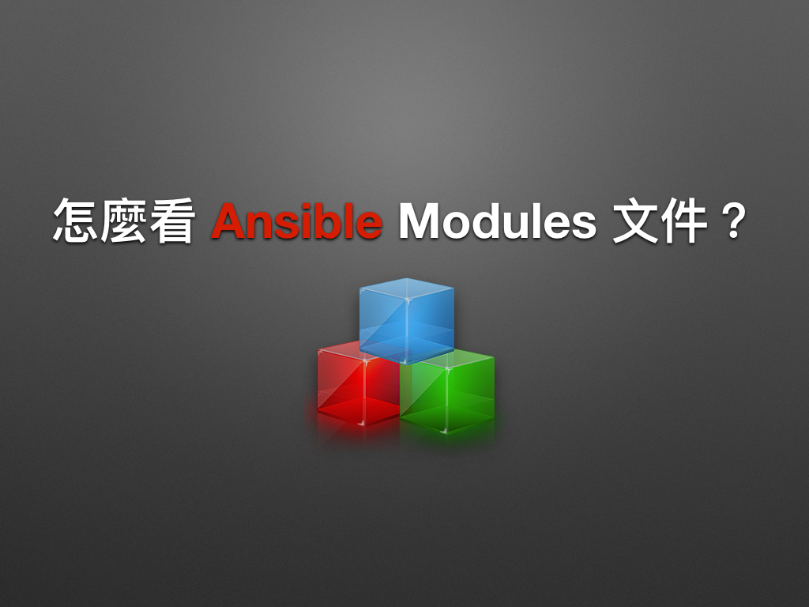
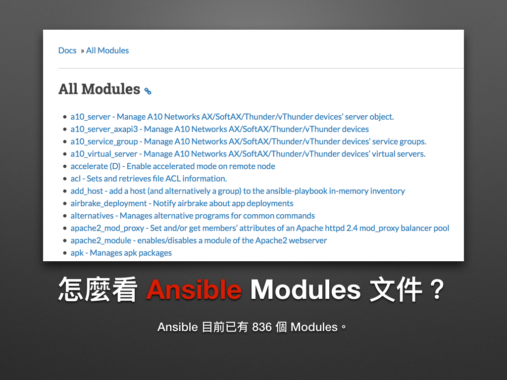
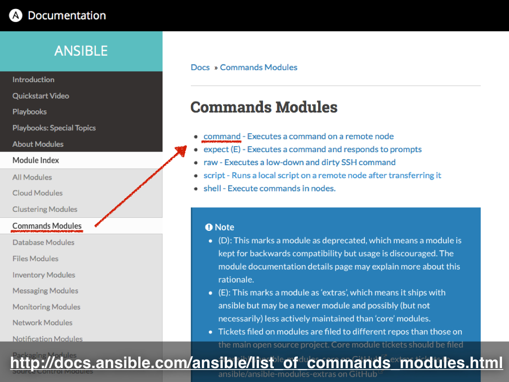
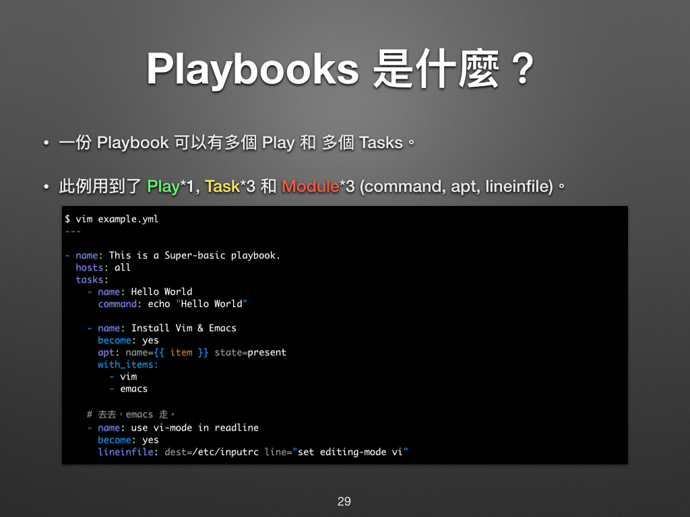
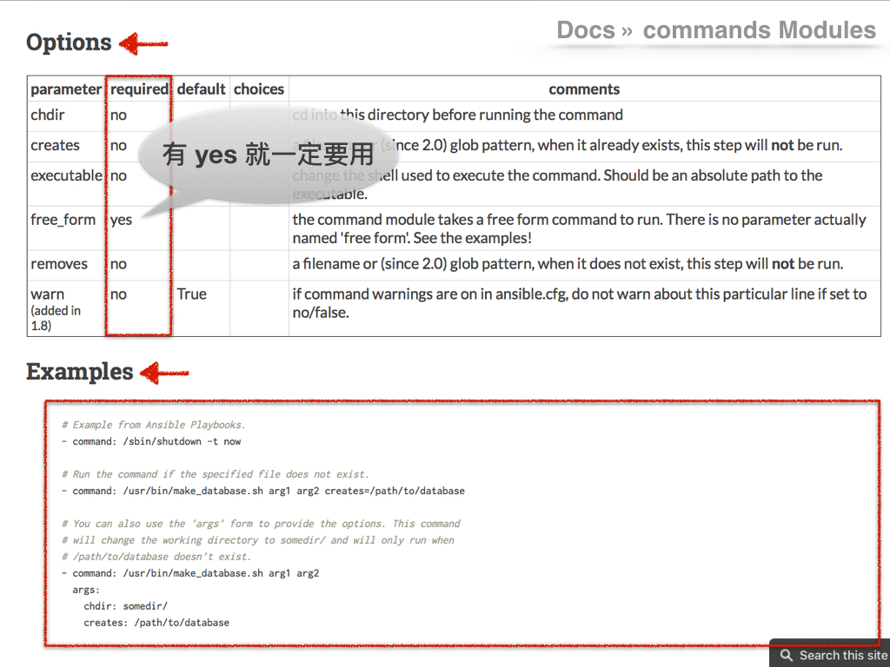

# 現代 IT 人一定要知道的 Ansible 自動化組態技巧

## 11. 怎麼看 Ansible Modules 文件？

在 Ansible 裡，我們其實都是透過現成的**模組 (Modules)** 在操作 Ansible，它就好比 Chef 的**資源 (Resource)** 一般，是使用這個組態管理工具最基本的**方法 (Method)**，只要掌握了如何使用 Modules 就可以快速上手，其餘都只是延伸使用罷了。

圖片來源：https://goo.gl/QkkyEd

Ansible Modules 的總數已來到 836 個之多，其種類約有 12 種，從套件 (Packaging)、資料庫 (Database)、通知 (Notification)、雲端 (Cloud)、Windows 到網路 (Network) 等。要是找不到想要的功能，我們還可以透過 `command` 和 `shell` 等 Modules 自行擴充。

接下來凍仁將會以 [`command` module][command_module] 來示範怎麼查 Modules 的使用方法。

1. 進入 [Ansible Documentation][ansible_doc] 網站。
1. 於左側點選 [Module Index][module_index] 的連結。
1. 於左側點選 [Commands Modules][commands_modules] 的連結。
1. 於內容頁點選 [command][command_module] 的連結。

  

1. 進到 `command` module 文件後，可先跳過上述的簡介。

  

1. 將畫面移至捲至下方的**範例 (Examples)**，先看看是不是我們要的功能。

  

1. 接著看**選項表 (Options)**，它會列出**必需使用的參數**和各參數的**預設值**，換句話說就是**有 yes 就一定要用！**
1. 最後記得瞄一下**大綱 (Synopsis)**，這邊常常會提到些注意事項，例如要用 [`apt` module][apt_module] 必需先滿足安裝 `python-apt` (Python 2) 或 `python3-apt` (Python 3) 的套件才行。
1. 現在大家不妨上 [Ansible Documentation][ansible_doc] 逛逛，或許會挖到不少寶藏喔！

[ansible_doc]: https://docs.ansible.com/ansible/latest/index.html
[module_index]: https://docs.ansible.com/ansible/latest/modules/modules_by_category.html
[commands_modules]: https://docs.ansible.com/ansible/latest/modules/list_of_commands_modules.html
[command_module]: https://docs.ansible.com/ansible/latest/modules/command_module.html
[apt_module]: https://docs.ansible.com/ansible/latest/modules/apt_module.html

### 後語

不得不說 Ansible Modules 的 Documentation 整理的很好，**常常**凍仁**只要看過 Examples** 後**就知道該怎麼用** Modules，需進階使用時才會回去看 **Options**；如果發現**有某個 module 怎麼用都出錯時，記得回頭看一下 Synopsis** 喔！

### 相關連結

- [06. 怎麼操作 Ansible？ | 現代 IT 人一定要知道的 Ansible 自動化組態技巧](06.how-to-use-ansible.md)
- [現代 IT 人一定要知道的 Ansible 自動化組態技巧 | 凍仁的筆記](http://note.drx.tw/2016/05/automate-with-ansible-basic.html)

