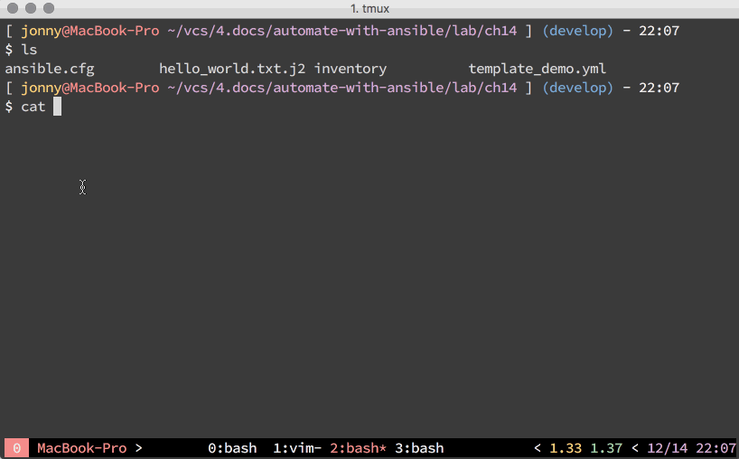
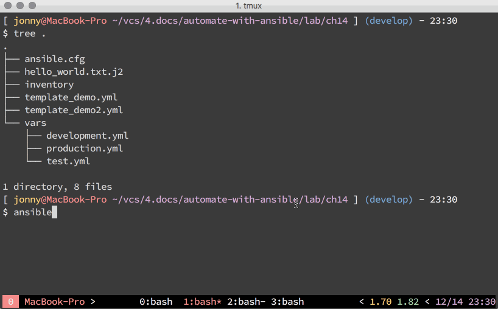

# 現代 IT 人一定要知道的 Ansible 自動化組態技巧

## 14. 怎麼使用 Ansible 的 Template 系統？

[template][template_module] module 是凍仁常用的檔案模組 (Files Modules) 之一，先前在「[12. 常用的 Ansible Module 有哪些？](12.which-are-the-commonly-used-modules.md)」一章時，也曾提到可以用它和變數 (Variables) 來操作檔案。

[template_module]: https://docs.ansible.com/ansible/latest/modules/template_module.html


▲ 圖片來源：http://www.freeiconspng.com/free-images/txt-file-icon-1203

我們只需事先定義變數和模板 (Templates)，即可用它動態產生遠端的 Shell Scripts、設定檔 (Configure) 等。換句話說，我們可以用一份 template 來產生開發 (Development)、測試 (Test) 和正式環境 (Production) 等不同環境設定。


### 舉例說明

說了那麼多，還是讓凍仁舉個例子說明吧！

1. 建立 template 檔案。

   ``` 
   $ vi hello_world.txt.j2
   Hello "{{ dynamic_word }}"
           ↑ ↑ ↑
   
   ```

   - 由於 Ansible 是藉由 [Jinja2](http://jinja.pocoo.org/) 來實作 template 系統，所以請使用 `*.j2` 的副檔名。
   - 上面的 ` "{{ dynamic_word }}" ` 代表我們在此 template 裡使用了名為 `dynamic_word` 的變數。

   > 註：`raw` 和 `endraw` 是為了相容 GitBook 所增加的語法，您可能會在某平台上看到它，請忽略之。

1. 建立 playbook，並加入變數。

   ``` 
   $ vi template_demo.yml
    1 ---
    2 - name: Play the template module
    3   hosts: localhost
    4   vars:
    5     dynamic_word: "World"
    6
    7   tasks:
    8     - name: generation the hello_world.txt file
    9       template:
   10         src: hello_world.txt.j2
   11         dest: /tmp/hello_world.txt
   12
   13     - name: show file context
   14       command: cat /tmp/hello_world.txt
   15       register: result
   16
   17     - name: print stdout
   18       debug:
   19         msg: "{{ result.stdout_lines }}"
   20
   21 # vim:ft=ansible :
   
   ```

   - 在第 5 行，我們幫 `dynamic_word` 變數設了一個預設值 `World`。
   - 在第 8 行的第 1 個 task 裡，我們使用了 template module，並指定了檔案的來源 (src) 和目的地 (dest)。
   - 之後的 2 個 tasks 則是把 template module 產生出來的檔案給印出來。

   > 註：`raw` 和 `endraw` 是為了相容 GitBook 所增加的語法，您可能會在某平台上看到它，請忽略之。

1. 執行 playbook。

   

   - 直接執行 playbook。

      ```
      $ ansible-playbook template_demo.yml
      ```

   - 透過 `-e` 參數將 `dynamic_word` 覆寫成 ansible。

      ```
      $ ansible-playbook template_demo.yml -e "dynamic_word=ansible"
      ```

   - 透過 `-e` 參數將 `dynamic_word` 覆寫成 Day14。

      ```
      $ ansible-playbook template_demo.yml -e "dynamic_word=Day14"
      ```


### 怎麼讓 Playbooks 切換不同的環境？

1. 在 Playbooks 裡除了用 `vars` 來宣告變數以外，還可以用 [`vars_files`][vars_files] 來 include 其它的變數檔案，如下例的第 7 行。

   ``` 
   $ vi template_demo2.yml
    1 ---
    2 - name: Play the template module
    3   hosts: localhost
    4   vars:
    5     env: "development"
    6
    7   vars_files:
    8     - vars/{{ env }}.yml
    9
   10   tasks:
   11     - name: generation the hello_world.txt file
   12       template:
   13         src: hello_world.txt.j2
   14         dest: /tmp/hello_world.txt
   15
   16     - name: show file context
   17       command: cat /tmp/hello_world.txt
   18       register: result
   19
   20     - name: print stdout
   21       debug:
   22         msg: "{{ result.stdout_lines }}"
   23
   24 # vim:ft=ansible :
   
   ```

   > 註：`raw` 和 `endraw` 是為了相容 GitBook 所增加的語法，您可能會在某平台上看到它，請忽略之。

1. 建立 `vars/development.yml`, `vars/test.yml` 和 `vars/production.yml` 檔案，接下來將依不同的環境 include 不同的變數檔案 (vars files)，這樣就可以用同一份 playbook 切換環境了！

   - Development

      ```
      $ vi vars/development.yml
      dynamic_word: "development"
      ```

   - Test

      ```
      $ vi vars/test.yml
      dynamic_word: "test"
      ```

   - Production

      ```
      $ vi vars/production.yml
      dynamic_word: "production"
      ```

1. 執行 playbook，並透過 `-e` 切換各個環境。

   

1. 此例是個簡單的範例，若要在大型的 Playbook 裡切環境，建議使用較進階的 `group_vars` 和 `host_vars`，詳情請參考「[19. 如何維護大型的 Playbooks？](19.how-to-maintain-the-complex-playbooks.md)」一章。

[vars_files]: https://docs.ansible.com/ansible/latest/user_guide/playbooks_variables.html#defining-variables-in-files


### 後語

template 系統是實務上很常見的手法之一，藉由它我們可以很輕鬆的讓開發、測試和正式環境無縫接軌。

現在是不是有**寫 code 管機器**的感覺了呢？(笑)


### 相關連結

- [Playbook variables ignored when used vars_files + ansible_os_family · Issue #8638 · ansible/ansible | GitHub](https://github.com/ansible/ansible/issues/8638)

