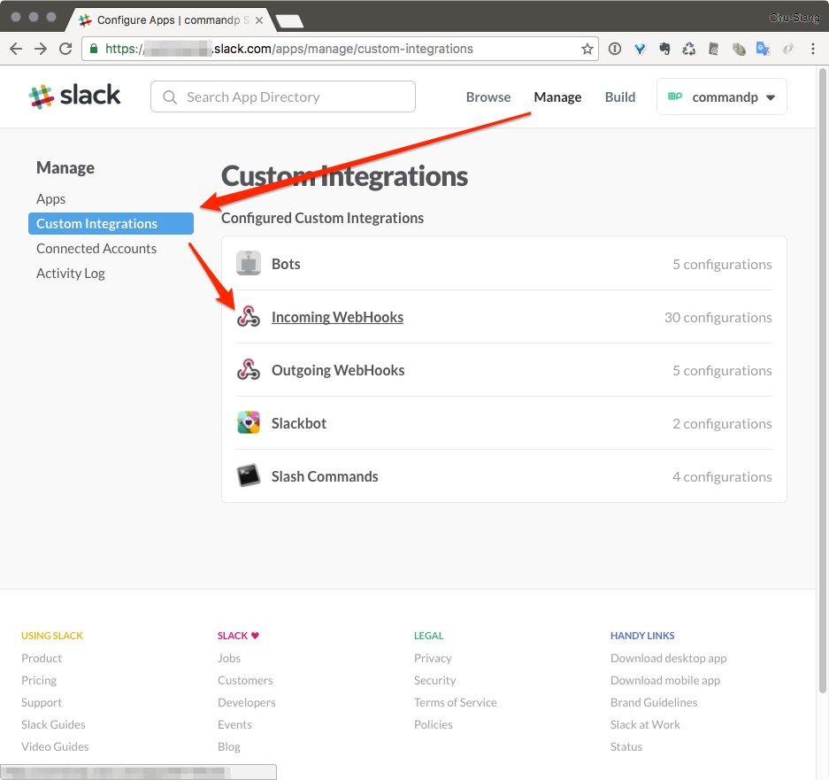
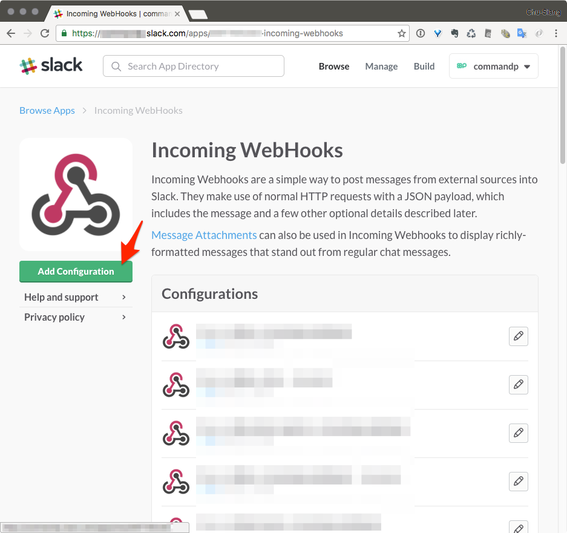
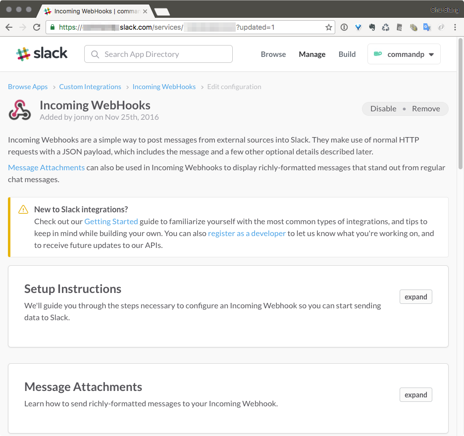
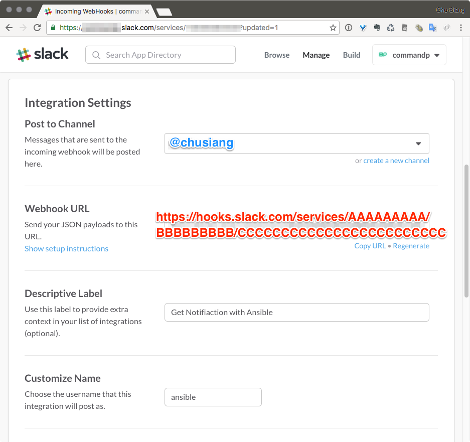
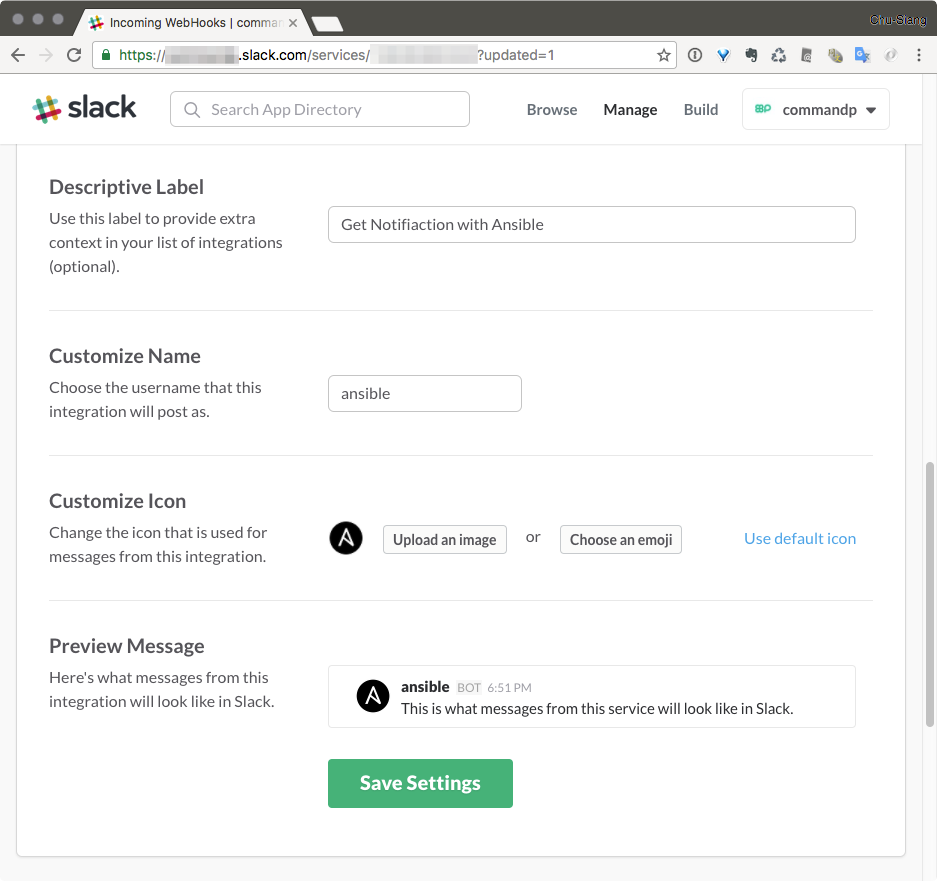

# 現代 IT 人一定要知道的 Ansible 自動化組態技巧

## 16. Ansible 如何發送 notification 到 Slack？

[Slack][slack_official] 是當前火紅的線上通訊服務，在台灣業界 [^1] 也有許多開發團隊在使用。除了可以用它與內部成員溝通外，透過發送通知訊息 (notification)、聊天機器人 (Chatbot) 等的資訊整合後，更發展出 ChatOps [^2] 一詞來形容這樣子的生態系。這次就讓凍仁分享一下 Ansible 整合 Slack 的小小心得。


▲ 上圖為 Ansible 發送 notification 到 Slack 的範例。

[slack_official]: https://slackhq.com

### slack module 是什麼？

[slack][slack_module] module 是用來發送訊息到 Slack 上的通知模組 (notification modules)，並藉由整合 Slack Incoming Webhook 功能進行使用。

[slack_module]: http://docs.ansible.com/ansible/slack_module.html

### Ansible 怎麼整合 Slack？

1. 撰寫發送 notification 到 Slack 的 Playbook：請依步驟 2 取得的參數設定 `slack_domain`, `slack_token` 和 `slack_channel` 等變數，若要發送 notification 到某個 Channel，可改用 `#channel_name`。

   ``` 
   $ vi send_notification_to_slack.yml
   ---
   - name: Send notification to Slack
     hosts: localhost
   
     vars:
       slack_domain: 'example.slack.com'
       slack_token: 'xxxxxxxxxxxxxxxxxxxxxxxx'
       slack_channel: "@username"
   
     post_tasks:
       - name: send notification to slack
         slack:
           domain: "{{ slack_domain }}"
           token: "{{ slack_token }}"
           username: "ansible"
           channel: "{{ slack_channel }}"
           color: "normal"
           msg: "Send a notification with Ansible !"
   
   # vim: ft=ansible :
   
   ```

   > 註：`raw` 和 `endraw` 是為了相容 GitBook 所增加的語法，您可能會在某平台上看到它，請忽略之。

1. 取得 Slack 的相關設定。

  1. 登入 Slack 後，進入 Manage (管理) 介面。

      

  1. 進入 Custom Integrations (自訂整合)，並找到 Incoming WebHooks。

      

  1. 點擊 Add Configuration 新增一個 WebHooks 給 Ansible 使用。

      

  1. 新增好 WebHooks 後的畫面如下。

      

  1. 將頁面往下捲至 **Integration Settings (整合設定)** 。

      

  1. 設定 **Post to Channel (預設發送頻道)** ：可先用 @username 進行測試。
  1. 取得 **Webhook URL**：以底下的 URL 為例，其中的 `CCCCCCCCCCCCCCCCCCCCCCCC` 即為 slack module 中的 `token`，也就是 send_notification_to_slack.yml Playbook 裡所缺少的 `slack_token`！

        https://hooks.slack.com/services/AAAAAAAAA/BBBBBBBBB/CCCCCCCCCCCCCCCCCCCCCCCC

  1. 最後上傳一張 Ansible 的圖示以利辨識。

      

1. 執行 Playbook。

   ```
   $ ansible-playbook send_notification_to_slack.yml
   
   PLAY [Send notification to Slack] **********************************
   
   TASK [setup] *******************************************************
   ok: [localhost]
   
   TASK [send notification to slack] **********************************
   ok: [localhost]
   
   PLAY RECAP *********************************************************
   localhost      : ok=2    changed=0    unreachable=0    failed=0
   ```

1. 在 Slack 接收從 Ansible 送出的 notification。

    

1. 現在我們的成功把 Ansible 和 Slack 整合好了！

> 順帶一提，若不想在每個 Playbooks 都重複宣告 `slack_domain`, `slack_token` 和 `slack_channel` 等變數，可使用「[14. 怎麼使用 Ansible 的 Template 系統？](14.how-to-use-the-ansible-template-system.md)」一章提到的 `vars_files` 進行改寫。


### 後語

讓 Ansible 發送 notifications 到 Slack 後，我們除了可以提醒自己有哪些 Playbooks 完成外，更可便於其它成員追蹤相關任務的進度和執行狀態等。

### 相關連結

- [How do I setup Slack notifications? | Deploy][deployhq]

[deployhq]: https://support.deployhq.com/articles/notifications/how-do-i-setup-slack-notifications


[^1]: 凍仁之前任職的 [commandp Inc.][commandp_official] 即為 Slack 的商業用戶之一。
[^2]: ChatOps 一詞凍仁曾在「[03. 怎麼部署 Ansible 環境？](03.how-to-deploy-the-ansible.md)」一章有提過，相信已有不少公司會藉由 Slack 這類的服務進行協同作業。

[commandp_official]: https://commandp.com

