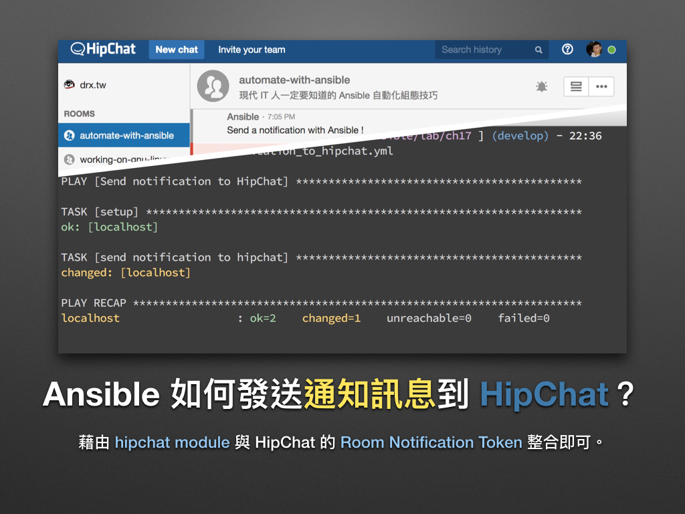
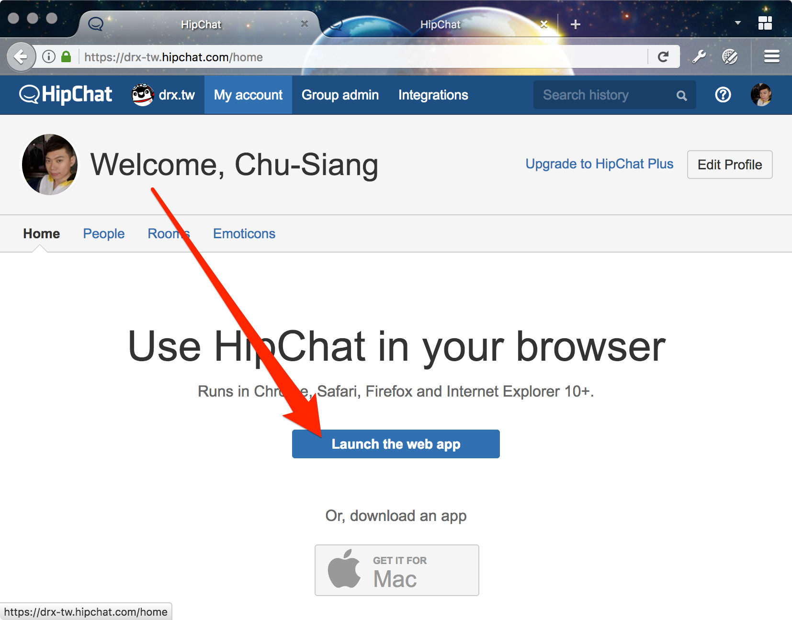
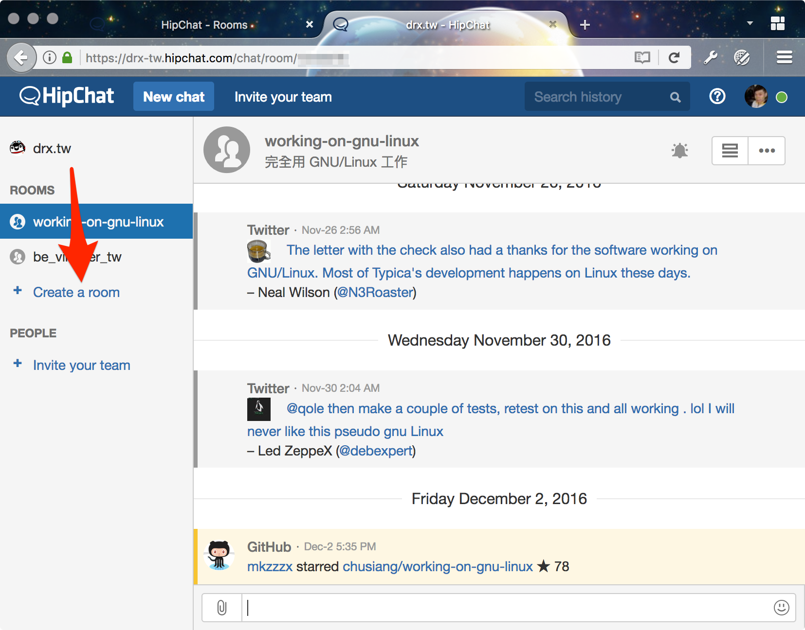
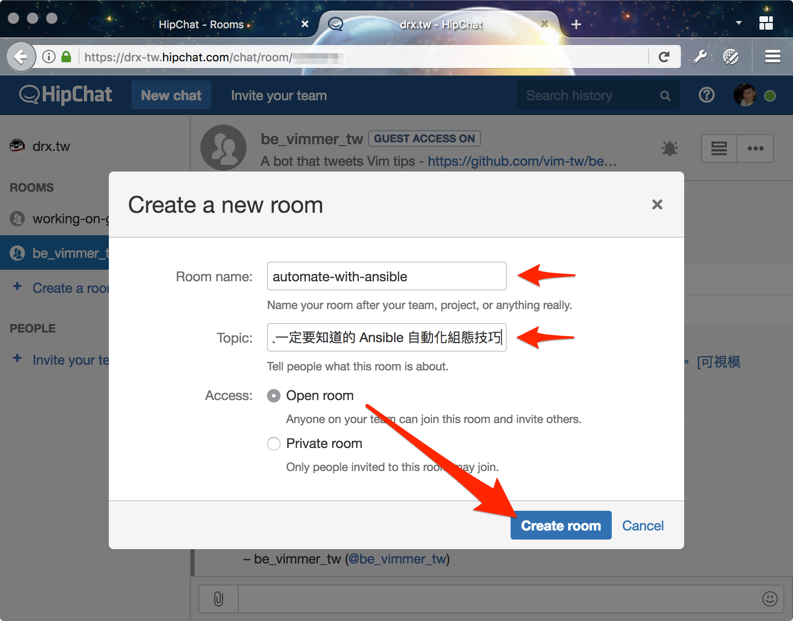
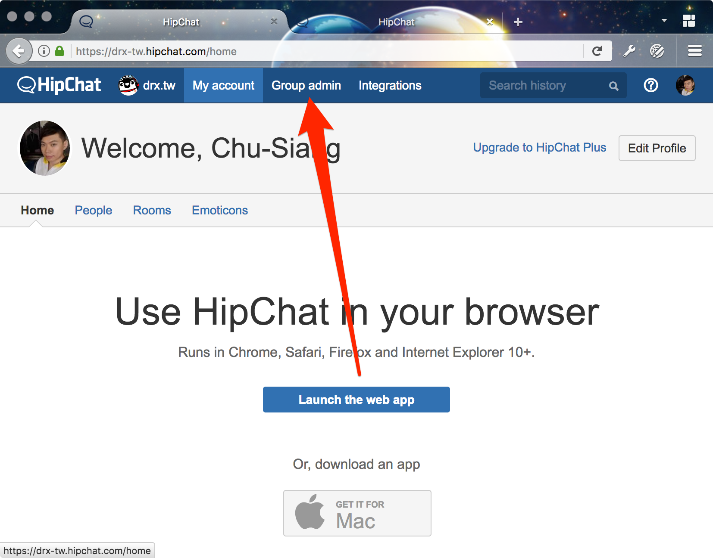
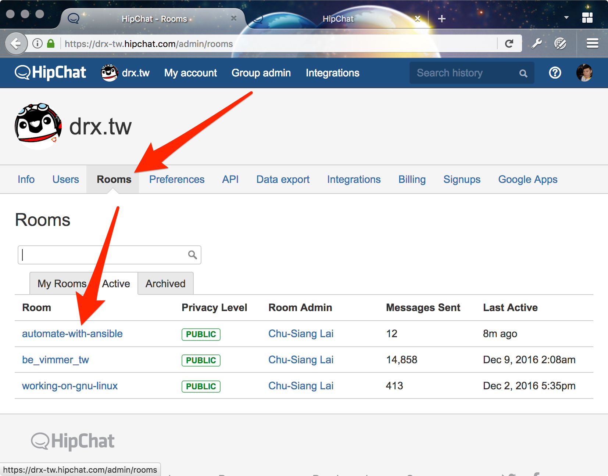
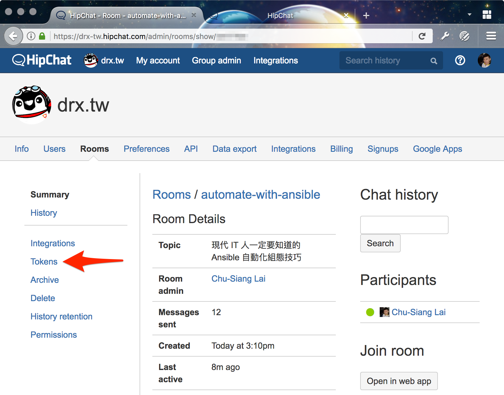
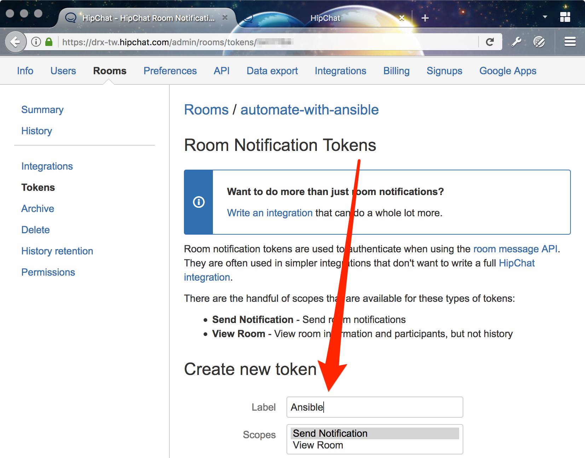
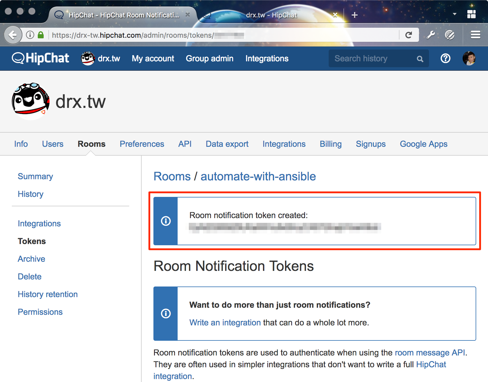
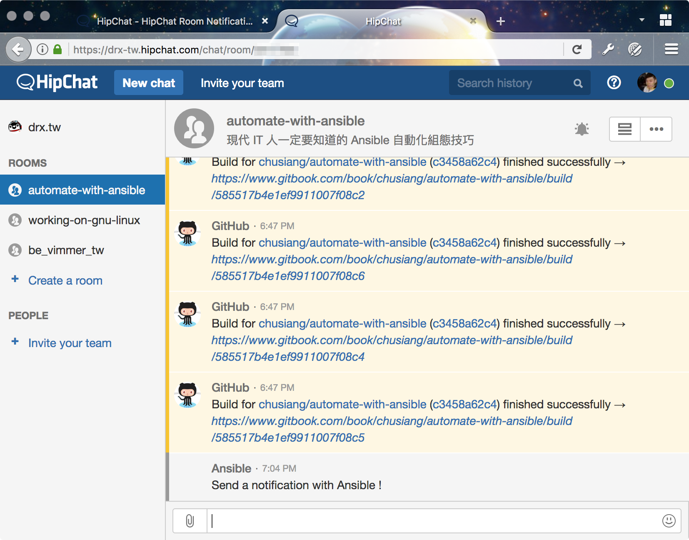

# 現代 IT 人一定要知道的 Ansible 自動化組態技巧

## 17. Ansible 如何發送 notification 到 HipChat？

[HipChat][hipchat_official] 是相當老牌線上通訊服務，官方也提供了不少整合方案。凍仁曾透過它整合 Ansible, [Git][git_official], [Jenkins][jenkins_official], [Redmine][redmine_official], [Skype][skype_official] 和 [Zabbix][zabbix_official] [^1] 等服務，當資訊集中在一處後，維運起來也會輕鬆許多。這裡凍仁將介紹 Ansible 整合 HipChat 的部份。[^2]


▲ 上圖為 Ansible 發送 notification 到 HipChat 的範例。

[hipchat_official]: https://www.hipchat.com
[git_official]: https://git-scm.com/
[jenkins_official]: https://jenkins.io/
[redmine_official]: http://www.redmine.org/
[skype_official]: https://www.skype.com/zh-Hant/
[zabbix_official]: http://www.zabbix.com/


### hipchat module 是什麼？

[hipchat][hipchat_module] module 是用來發送訊息到 HipChat 上的通知模組 (notification modules)，我們只需取得 Room notification Token 即可使用。

[hipchat_module]: https://docs.ansible.com/ansible/latest/modules/hipchat_module.html

### Ansible 怎麼整合 HipChat？

1. 撰寫發送 notification 到 HipChat 的 Playbook：請依步驟 2 取得的參數設定 `hipchat_token` 和 `hipchat_room` 等變數。[^3]

   ``` 
   $ vi send_notification_to_hipchat.yml
   ---
   - name: Send notification to HipChat
     hosts: localhost

     vars:
       hipchat_token: 'xxxxxxxxxxxxxxxxxxxxxxxxxxxxxxxxxxxxxxxx'
       hipchat_room: "automate-with-ansible"

     post_tasks:
       - name: send notification to hipchat
         hipchat:
           api: "https://api.hipchat.com/v2/"
           token: "{{ hipchat_token }}"
           room: "{{ hipchat_room }}"
           color: gray
           msg: "Send a notification with Ansible !"

   # vim: ft=yaml.ansible :
   
   ```

   > 註：`raw` 和 `endraw` 是為了相容 GitBook 所增加的語法，您可能會在某平台上看到它，請忽略之。

1. 取得 HipChat 的 Room Notification Token。

  1. 登入 HipChat 後，開啟 web app。

     

  1. 建立一間新的 Room。

     

  1. 幫這個 Room 取個名字並簡單介紹一下用途。

     

  1. 回到 HipChat 的管理介面，並找到 **Group Admin (群組管理)** 。

     

  1. 在 Rooms 底下找到要整合 Ansible 的 Room。

     

  1. 點選左側的 **Tokens**。

     

  1. 在 **Create New Token** 輸入 `Ansible` 和選擇 `Send Notification` 的 Scopes，之後接下 **Create**。

     

  1. Token 建立完畢後，即可在紅框裡取得剛建立的 **Token**。

     

1. 執行 Playbook。

       $ ansible-playbook send_notification_to_hipchat.yml

       PLAY [Send notification to HipChat] ********************************

       TASK [setup] *******************************************************
       ok: [localhost]

       TASK [send notification to hipchat] ********************************
       changed: [localhost]

       PLAY RECAP *********************************************************
       localhost      : ok=2    changed=1    unreachable=0    failed=0

1. 在 HipChat 接收從 Ansible 送出的 notification。

     

1. 現在我們可以在 HipChat 裡接收來自 Ansible 的 notification 了！

### 後語

Ansible 與 HipChat 的組合在使用上會比 Slack 簡單許多，雖然 HipChat 不比 Slack 的高度客製化，但凍仁認為它的門壏比較低，適合需求較單純的團隊。

至於要選哪一家作為 ChatOps 的平台？這就是另一門學問了。(笑)


### 相關連結

- [hipchat \- Send a message to hipchat\. | Ansible Documentation][hipchat_module]
- [16. Ansible 如何發送 notification 到 Slack？ | 現代 IT 人一定要知道的 Ansible 自動化組態技巧](16.how-to-send-notification-to-slack-on-ansible.md)
- [透過 Zabbix 監控 VPN \(PPPoE\) 狀態 | 凍仁的筆記][drx_tw_zabbix_vpn_pppoe]

[drx_tw_zabbix_vpn_pppoe]: http://note.drx.tw/2015/03/zabbix-vpn-pppoe.html


[^1]: Zabbix 是企業級的 open source 監控系統，搭配 HipChat 使用後可以讓我們在極短的時間內掌握伺服器 (Server) 和網路設備等狀況。

[^2]: 凍仁先前於高雄任職的公司有使用 HipChat，但後期只剩 IT 維運部門在用就是。

[^3]: 由於 HipChat 在設計是綁定房間 (Room) 使用的，不像 Slack 可用一組設定發送訊息到不同的頻道，若有這類需求則可透過多個 Tasks 和 Tokens 進行實作。
