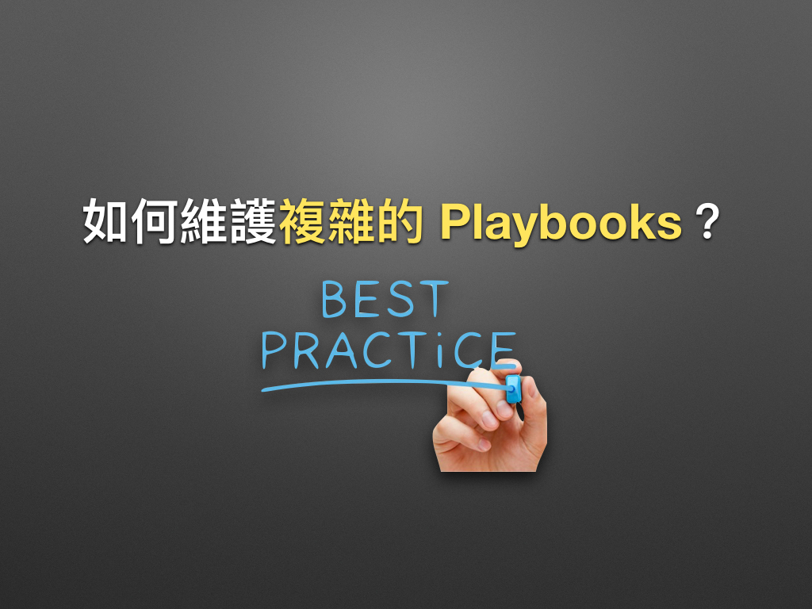

# 現代 IT 人一定要知道的 Ansible 自動化組態技巧

## 19. 如何維護大型的 Playbooks？

在學時，凍仁曾藉由大型程式來撰寫複雜的 C 語言。如今當 Ansible Playbooks 寫久之後，其架構也會變得複雜，這時該怎麼寫才好維護呢？就讓凍仁娓娓道來吧！


▲ 圖片來源：https://goo.gl/jBL5i3 。

官方早在 [Playbooks Best Practices][playbooks_best_practices] 文件中列了 12 條最佳實踐 (Best Practices)，底下將以凍仁認為最重要的部份進行介紹。

[playbooks_best_practices]: https://docs.ansible.com/ansible/latest/user_guide/playbooks_best_practices.html


### 什麼是最佳實踐 (Best Practices)？

來自維基百科的解釋：

> 最佳實踐，是一個管理學概念，認為存在某種技術、方法、過程、活動或機制可以使生產或管理實踐的結果達到最優，並減少出錯的可能性。[(more)][wikipedia_best_practices]

[wikipedia_best_practices]: https://zh.wikipedia.org/zh-tw/最佳实践

凍仁認為，Best Practices 就如同 80/20 法則，只要掌握了 Best Practices，就可以用 20% 的投入獲得 80% 的成效。

在許多技術文件裡 (如 [Android][android_best_practices], [AWS][aws_best_practices] 和 [Vue.js][vuejs_best_practices]) 也會有這個特別的章節，甚至還有前輩向凍仁提到，剛接觸一門新技術時，應該要先從 Best Practices 開始看起呢！

[android_best_practices]: https://developer.android.com/guide/practices/index.html
[aws_best_practices]: https://aws.amazon.com/whitepapers/architecting-for-the-aws-cloud-best-practices/
[vuejs_best_practices]: http://012.vuejs.org/guide/best-practices.html


### 官方建議的目錄結構

以下修改至官方建議的目錄結構 (Directory Layout) 範例，凍仁只留下較常用的部份。

```
production        # inventory file for production.
staging           # inventory file for staging.

group_vars/
   group1         # here we assign variables to particular groups
   group2
host_vars/
   hostname1      # if systems need specific variables, put them here
   hostname2

site.yml          # master playbook
webservers.yml    # playbook for webserver tier
dbservers.yml     # playbook for dbserver tier

roles/
  common/         # role name
    tasks/        #
      main.yml    # main tasks file.
    handlers/     #
      main.yml    # handlers file.
    templates/    #
      ntp.conf.j2 # templates end in .j2.
    files/        #
      bar.txt     # files
      foo.sh      # script files
    vars/         #
      main.yml    # variables with this role.
    defaults/     #
      main.yml    # default variables.
    meta/         #
      main.yml    # role dependencies
```

  - `production`, `staging`：藉由 inventory file 來切換環境。我們在「[14. 怎麼使用 Ansible 的 Template 系統？](14.how-to-use-the-ansible-template-system.md)」一章時已提過，在 Best Practices 裡就有特別說明此手法。
  - `site.yml`：主要的 playbook。
  - `webservers.yml`：網頁伺服器一層的 playbook。
  - `dbservers.yml`：資料庫伺服器一層的 playbook。


### 實戰用的目錄結構

底下將以某個用 django 開發的 API web server 專案為例。

```
README.md               # 該專案的說明文件。
Vagrantfile
ansible.cfg             # configure for ansible
files/
  id_rsa_deploy         # 用 Git 部署的 ssh key。
  ssl_key/
    ...
group_vars/
  all                   # 各環境共用的群組變數。
  local                 # 本機開發的群組變數。
  production            # 正式環境的群組變數。
  staging               # 測試環境的群組變數。
production              # 正式環境的 inventory file。
requirements.yml
restart_service.yml     # 重開 API 服務的 playbook。
roles/
  chusiang.switch-apt-mirror/
  ...
setup.yml               # 主要 playbook。
staging                 # 測試環境的 inventory file。
tasks/
  restart_api.yml       # 重開 api 的 tasks。
  setting_api.yml       # 設定 api 的 tasks。
  setting_nginx.yml     # 設定 nginx 的 tasks。
  setup.yml             # 主要安裝流程的 tasks。
templates/
  local_settings.py.j2
  nginx.conf.j2         # nginx vhost.
  nginx_ssl.conf        # nginx vhost (ssl).
  supervisor.conf.j2
tests/
  Dockerfile            # 用 Docker 跑測試。
update_config.yml
```

  - `Vagrantfile`：在本機主要使用 Vagrant 搭配 `group_vars/local` 進行開發。
  - `ansible.cfg`：依各專案客製 Ansible 相關環境。
  - `files/`：集中管理要使用 files module 複製到 Managed node 的檔案。
  - `group_vars/`：設定 staging, production 等不同群組 (環境) 變數的好物 [^1]；若有共用變數的部份可寫在 `all` 檔案裡。
  - `setup.yml`：include 各種 tasks 的主要 playbook。
  - `tasks/`：將各種不同任務獨立出來的 tasks，在裡分別為 `restart_api.yml`, `setting_nginx.yml` 和 `setup.yml`。
  - `templates/`：集中管理要使用 templates module 複製到 Managed node 的檔案。


### 總結

大家可以先照著官方的規劃練習，寫久了再依個人風格調整即可，畢竟要讓大型的 Playbooks 變得好維護，不外乎為以下原則：

1. 透過 `inventory` 和 `group_vars` 來定義 local, staging 和 production 等各環境的主機和變數。
1. 儘可能的把重複的 tasks 獨立出來，然後讓 playbook 依不同需求 include 進來用。在這個例子裡，凍仁把 `setup.yml` 和 `update_config.yml` 兩個 playbook 中重複的 tasks 獨立成 `tasks/setting_api.yml`，並透過 `include` 重複使用。
1. **時間允許的話，把重複的 tasks 改寫成，Roles 吧！**


### 後語

我們可以藉由 Roles 讓大型的 Playbooks 更易於維護，在此文中也一直提到它的重要性，這部份就讓凍仁留到下一章介紹了。


### 相關連結

- [Best Practices — Ansible Documentation](https://docs.ansible.com/ansible/latest/user_guide/playbooks_best_practices.html#directory-layout)
- [ansible/ansible-examples | GitHub](https://github.com/ansible/ansible-examples)
- [Ansible Galaxy | chusiang.switch-apt-mirror](https://galaxy.ansible.com/chusiang/switch-apt-mirror/)


[^1]: `group_vars` 將與 inventory file 裡的 group 配置連動，也就是 Ansible 會處理切換群組變數的部份，我們不需再用「[14. 怎麼使用 Ansible 的 Template 系統？](14.how-to-use-the-ansible-template-system.md)」一章提到的 `vars_files` 來手動 include 群組變數。

