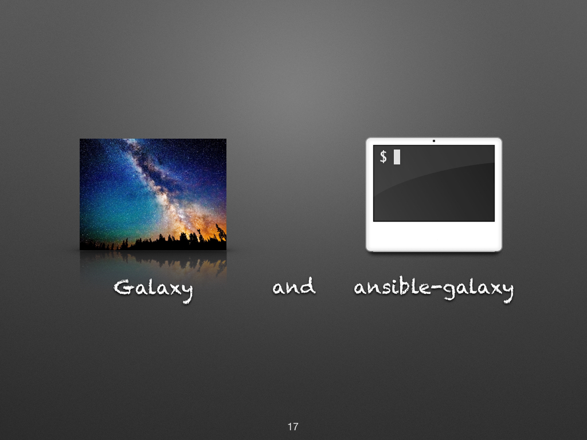
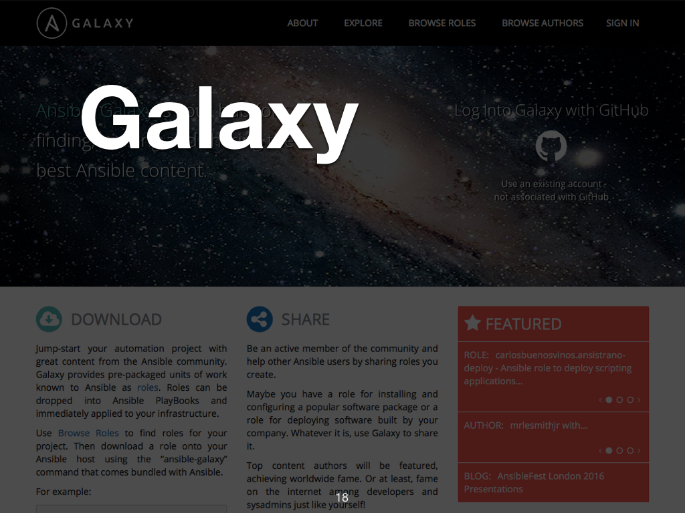
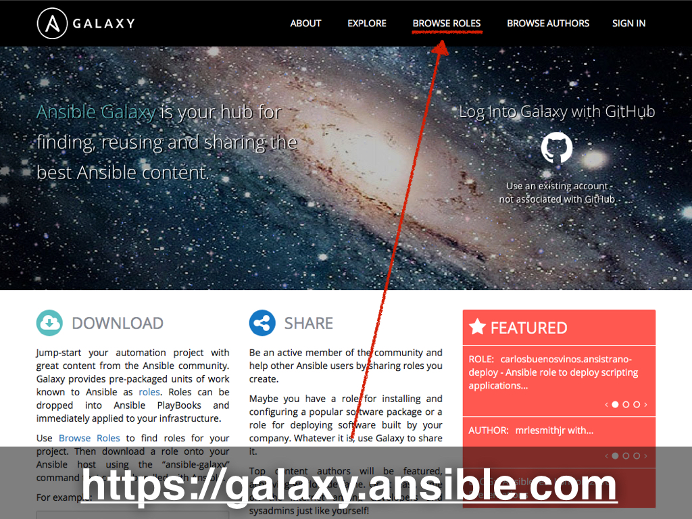
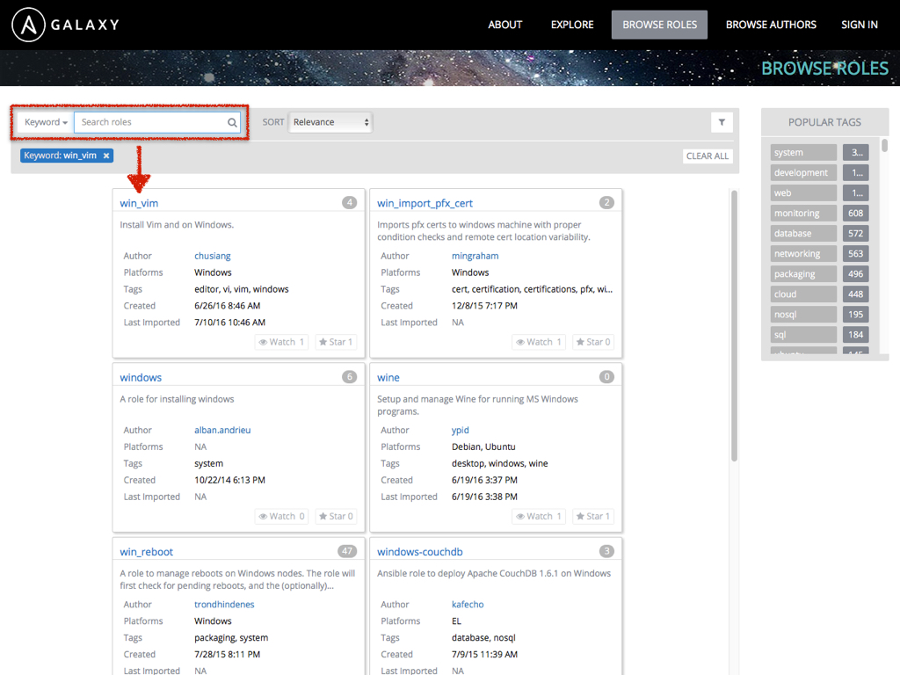
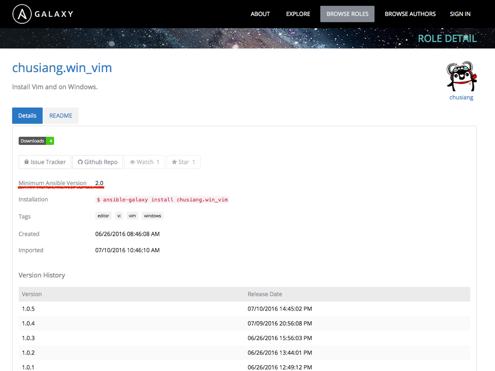
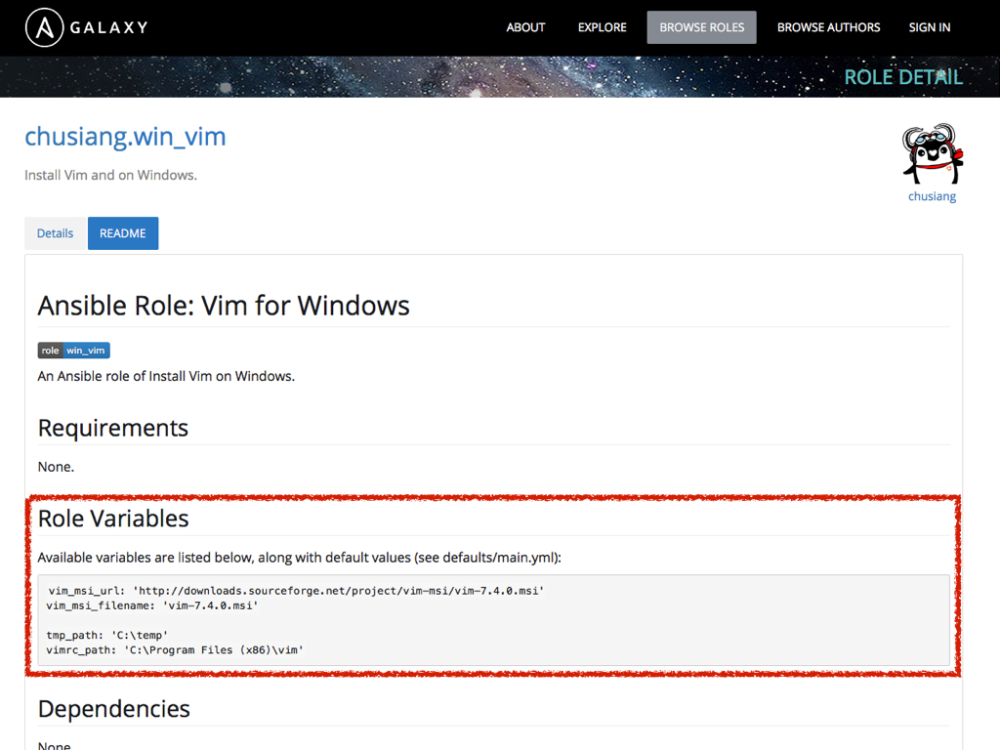
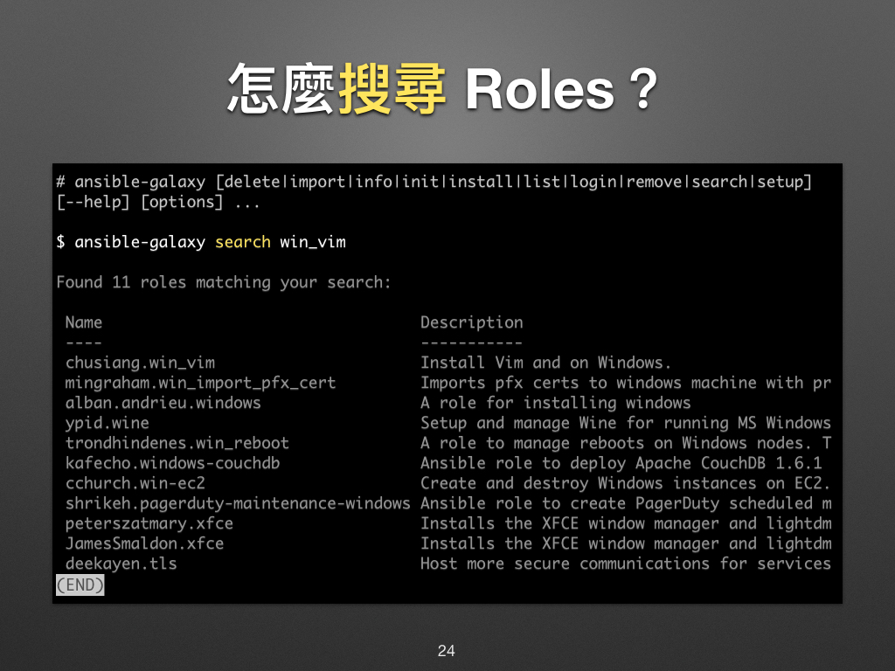
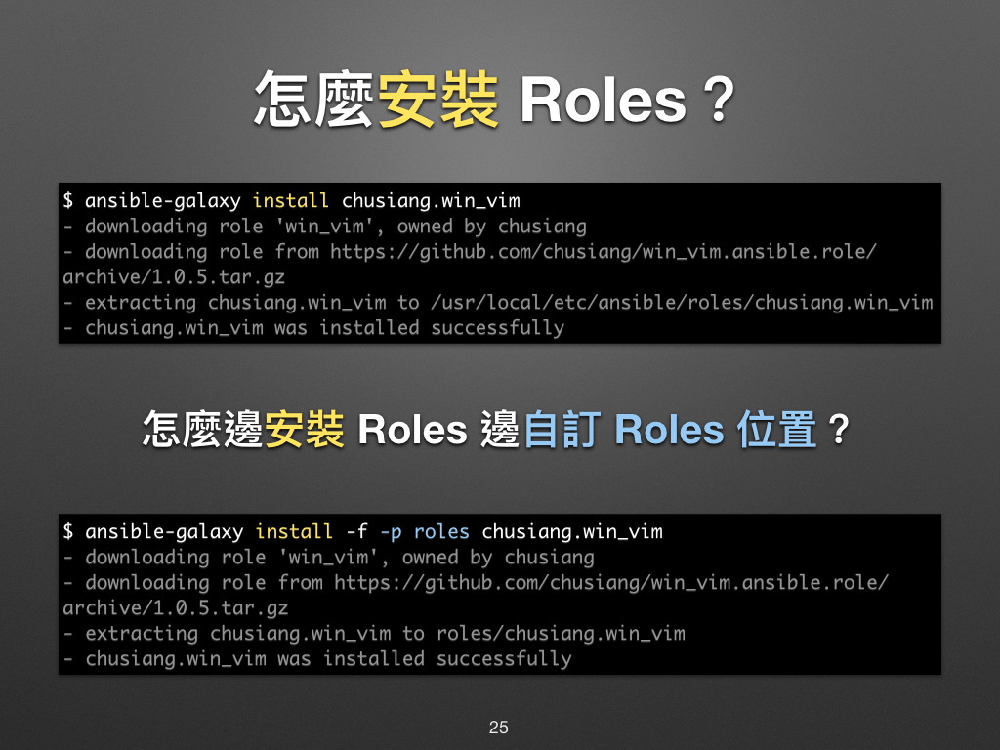
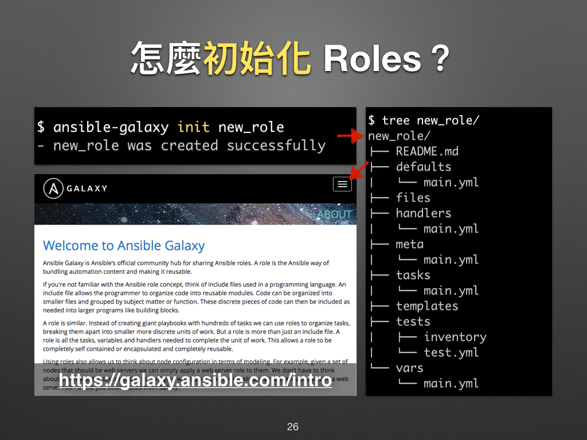

# 現代 IT 人一定要知道的 Ansible 自動化組態技巧

## 21. 怎麼使用 Roles？

上一章「[20. Roles 是什麼？](20.what-is-the-roles.md)」凍仁簡單介紹了 Roles，接下來重頭戲登場囉！


我們可以透過 **[Galaxy][ansible_galaxy] (銀河)** 和 `ansible-galaxy` (Terminal) 來使用 Roles。




### 什麼是 Galaxy？

[Galaxy][ansible_galaxy] 的全名為 Ansible Galaxy，它是官方維護的 Roles 市集 (marketplace) 網站。我們可以在網站上取得社群成員所維護的 Roles，其 source code 存放於 GitHub。



### ansible-galaxy 是什麼？

`ansible-galaxy` 是管理 Roles 的指令，我們可以在 Terminal 裡用它搜尋 (search)、安裝 (install)、移除 (remove) Roles 等。換句話說它是 Ansible 世界的 `pip`。


想深入了解 `ansible-galaxy` 的話，不妨 man 一下它！

```
$ man ansible-galaxy
```

### 怎麼用 Galaxy 搜尋 Roles？

1. 開啟瀏覽器 (Browsers) 並進入 [https://galaxy.ansible.com][ansible_galaxy]。
1. 進到 Galaxy 的網站後，可在右上角的 Browser Roles 找到數不完的 Role。

  

1. 在 **Keyword** 一欄輸入關鍵字後，接下 `Enter` 即可搜尋。底下將以 `win_vim` role 為例。

  

1. 在 **Details** 頁籤裡，可以看到關於這個 Role 的版本記錄 (Version History)、支援的平台 (Supported Platforms) 等資訊。

  > Ansible 最小支援版本 (Minimum Ansible Version) 的部份也請留意，有些語法在舊版的 Ansible 是不被支援的喔！

  

1. 在 **README** 頁籤裡，可以看到作者寫的說明文件。一般會在 **Role Variables** 底下列出哪些可以被覆寫的預設變數。

  


### 怎麼用 ansible-galaxy 搜尋 Roles？

除了在 Galaxy 網站搜尋 Roles 以外，我們也可以使用 `ansible-galaxy search` + `關鍵字`進行搜尋。




## 怎麼安裝 Roles？

請使用 `ansible-galaxy install` + `Role 名稱` 來安裝 role，如要自訂存放 Roles 的位置，請使用 `-p` + `路徑`，詳情請參考 [Download Roles | Ansible Galaxy][galaxy_download_roles] 一文。

[galaxy_download_roles]: https://galaxy.ansible.com/intro#download




## 怎麼初始化 Roles？

我們可以用 `ansible-galaxy init` + `Role 名稱` 來建立一個新 role，其檔案結構部份凍仁已在上一章的「[Role 的基本結構][role_layout]」介紹過，這裡就不詳述了。

[role_layout]: 20.what-is-the-roles.md#role-%E7%9A%84%E5%9F%BA%E6%9C%AC%E7%B5%90%E6%A7%8B



以上，您學會怎麼使用 Roles 了嗎？下章凍仁將教大家如何利用 Galaxy 上的 Roles 建置 LNMP 環境。


### 後語

我們除了可以在 Galaxy 找到現成的 Roles 外，更可藉由閱讀前人的 source code 來學習各種知識與技巧。

**倘若覺得別人的 Roles 不好使，您就自己寫一個，然後分享出來吧！**


### 相關連結

- [Ansible Galaxy \| Find, reuse, and share the best Ansible content][ansible_galaxy]
- [Ansible: Up and Running — an O’Reilly book by Lorin Hochstein][ansiblebook]
- [現代 IT 人一定要知道的 Ansible 自動化組態技巧 Ⅱ - Roles & Windows | 凍仁的筆記][automate-with-ansible-roles-windows]

[ansible_galaxy]: https://galaxy.ansible.com/
[ansiblebook]: http://www.ansiblebook.com
[automate-with-ansible-roles-windows]: http://note.drx.tw/2016/07/automate-with-ansible-roles-windows.html

