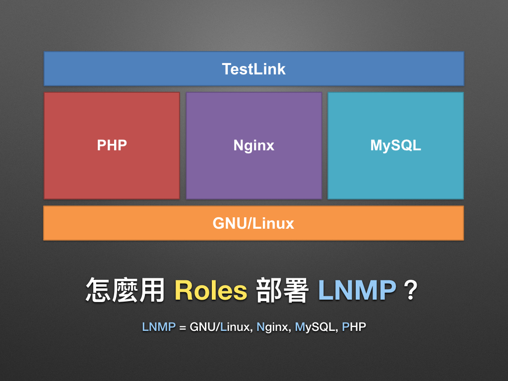

# 現代 IT 人一定要知道的 Ansible 自動化組態技巧

## 22. 怎麼用 Roles 部署 LNMP 網頁應用程式？(上)

上一章「[21. 怎麼使用 Roles？](21.how-to-use-the-roles.md)」我們探索了 [Galaxy][ansible_galaxy] (銀河)，並學習了 Roles 的使用方法，接下來凍仁教大家如何用 Roles 部署 TestLink 這套相依於 LNMP 環境的網頁應用程式。

> LNMP = Linux + Nginx + MySQL + PHP

[ansible_galaxy]: https://galaxy.ansible.com

### TestLink 是什麼？

[TestLink][testlink_official] 是一套開源的測試管理軟體。其部署的方法與 Drupal 和 Wordpress 等內容管理系統 (CMS) 相似，皆可使用 GNU/Linux + Web server + MySQL + PHP 環境進行安裝。

來自維基百科的解釋：

> TestLink，是一個用於管理測試過程並提供統計分析的開源軟體。該軟體發布於 sourceforge，並採用 Web 界面交互，可以進行自動化的測試用例運行，並將測試結果生成報表並歸檔。[(more)][wikipedia_testLink]

[testlink_official]: http://testlink.org
[wikipedia_testLink]: https://zh.wikipedia.org/wiki/TestLink

### 怎麼選 Roles？

由於 Galaxy 上的 Roles 皆由社群成員所維護，故使用前凍仁會藉由以下幾點來挑撰合適的 Roles。

1. 是否支援我們要用的作業系統 (OS)？
 - 若不支援請直接找下一個。
1. 是否支援多個 OS 平台？
 - 通常支援多個 Linux 發行版本的 Roles 質量會比較好一些。
1. 有無整合 [Travis CI][travis_ci_official] 進行測試？
 - 有整合 CI 就可以從 README 的 Badge 上看到建置的結果。
 - 綠色為成功；紅色代表失敗。
1. 得到的星星數多不多？
 - 不是一定要找到很多星星才可以用，不過星星數越多代表被越多人認可。
1. 下載數多不多？
 - 同第 4 點。
1. 最後更新的時間點為何？
 - 有時會找到看起來似乎很棒，但距離上次更新已是一兩年前，年久失修的狀況。

[travis_ci_official]: https://travis-ci.org

在這裡的範例裡，凍仁挑選了以下三個同時支援 CentOS, Debian 和 Ubuntu 平台的 Roles。

- [`williamyeh.nginx`][williamyeh_nginx]
- [`chusiang.php7`][chusiang_php7] [^2]
- [`geerlingguy.mysql`][geerlingguy_mysql]

[itcraftsmanpl_php7]: https://github.com/itcraftsmanpl/ansible-role-php7
[chusiang_php7]: https://galaxy.ansible.com/chusiang/php7/
[williamyeh_nginx]: https://galaxy.ansible.com/williamyeh/nginx/
[geerlingguy_mysql]: https://galaxy.ansible.com/geerlingguy/mysql/

以上，在這一章我們認識系統需求，也挑選了合適的 Roles，下章凍仁將帶大家用 Roles 撰寫強化版的 Playbooks。

### 相關連結

- [現代 IT 人一定要知道的 Ansible 自動化組態技巧 Ⅱ - Roles & Windows | 凍仁的筆記][automate-with-ansible-roles-windows]

[automate-with-ansible-roles-windows]: http://note.drx.tw/2016/07/automate-with-ansible-roles-windows.html

[^1]: 凍仁第一次聽到 TestLink 是在 2013 年的夏天, 那時接到主管指派在下幫某位女同事架站，才知道有那麼一套專為管理測試導向的 CMS。

[^2]: `chusiang.php7` 是凍仁從 [`itcraftsmanpl.php7`][itcraftsmanpl_php7] fork 出來，並加入支援 CentOS 6, 7 平台的 Role，同時也是凍仁第一個分享至 Galaxy 的 Role。

