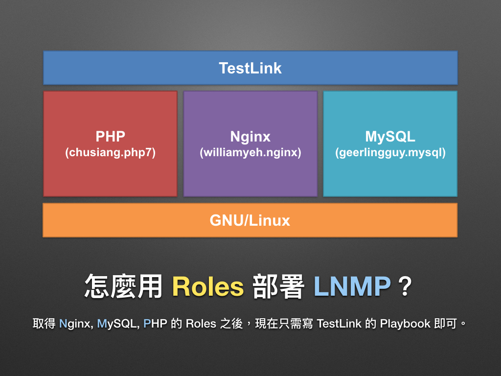
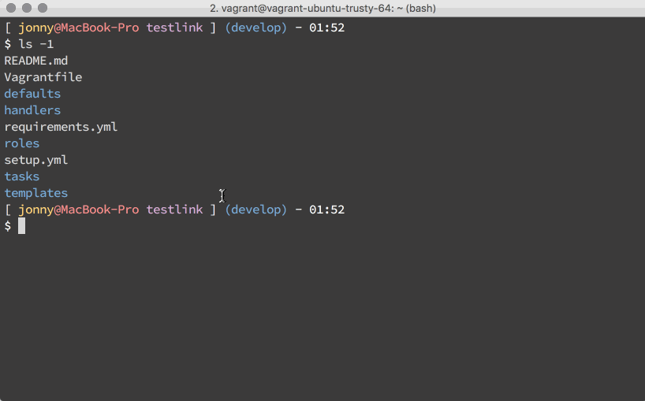
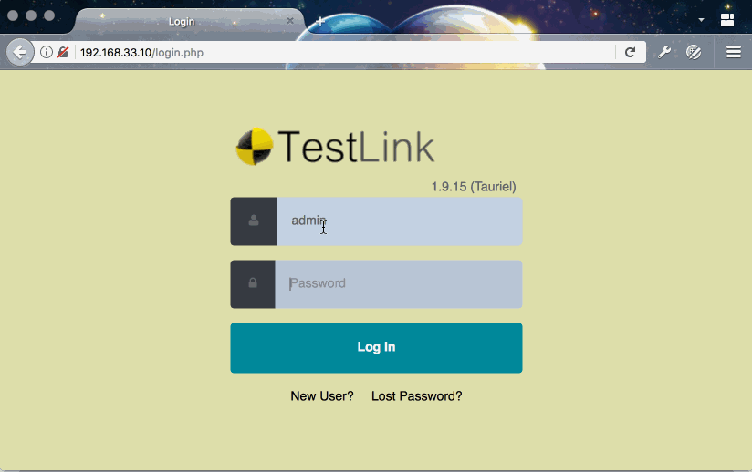

# 現代 IT 人一定要知道的 Ansible 自動化組態技巧

## 23. 怎麼用 Roles 部署 LNMP 網頁應用程式？(下)

上一章「[22. 怎麼用 Roles 部署 LNMP 網頁應用程式？(上)](22.how-to-setup-lnmp-webapp-with-roles-1.md)」我們挑選了 Nginx, MySQL 和 PHP 的 Roles，接下來就讓凍仁展示怎麼用 Roles **簡化**大型的 TestLink Playbooks 吧！




### 怎麼用 Roles 撰寫強化版的 Playbooks？

在這份 Playbooks 與「[19. 如何維護大型的 Playbooks？](19.how-to-maintain-the-complex-playbooks.md)」不同的是，凍仁除了把 variables, tasks, handlers 拆開寫以外，還加入 Roles 的部份。

#### 取得範例檔

為避免版面過於混亂，凍仁已上傳範例檔，還請大家先至 [GitHub][automate_with_ansible] 下載。

##### Git

1. 取得 demo code。

  ```
  $ git clone https://github.com/chusiang/automate-with-ansible.git
  ```

1. 進入 testlink 目錄。

  ```
  $ cd automate-with-ansible/lab/ch23/testlink
  ```

##### Zip

1. 若不想使用 Git，可改下載 zip 檔。

  ```
  $ wget https://github.com/chusiang/automate-with-ansible/archive/master.zip
  ```

1. 解壓縮。

  ```
  $ unzip automate-with-ansible-master.zip
  ```

1. 進入 testlink 目錄。

  ```
  $ cd automate-with-ansible-master/lab/ch23/testlink/
  ```

#### 從 Galaxy 下載 Roles

透過凍仁定義好的 `requirements.yml` 下載多個 Roles，詳情請參考 [Installing multiple roles from a file | Ansible Documentation][ansible_galaxy_requirements_yml] 一文。

> 在 Python 的世界裡，我們可藉由 `requirements.txt` 批次下載 pip 套件，而在 Ansible 的世界裡則是 `requirements.yml`。

```
$ ansible-galaxy install -f -p roles -r requirements.yml
```

[ansible_galaxy_requirements_yml]: https://docs.ansible.com/ansible/latest/galaxy/user_guide.html#installing-multiple-roles-from-a-file


#### 使用 Vagrant 建立開發環境

由於這次的 `Vagrantfile` 有設置 provision (配置) ansible 的語法，故使用 `vagrant up` 時會一併執行 playbook。詳情請參考「[04. 怎麼用 Vagrant 練習 Ansible？](04.how-to-practive-the-ansible-with-vagrant.md)」一文。

1. 觀看 Vagrantfile 內容。

  ```ruby
  $ cat Vagrantfile
  # -*- mode: ruby -*-

  Vagrant.configure("2") do |config|
    config.vm.box = "ubuntu/trusty64"
    config.vm.provider "virtualbox" do |vb|
      vb.memory = "1024"
    end
    config.vm.provision "ansible" do |ansible|
      ansible.playbook = "setup.yml"
      ansible.sudo = true
      #ansible.verbose = "vvv"
    end
  end

  # vi: set ft=ruby :
  ```


#### 執行 Playbooks

1. 啟用虛擬機並執行 Playbook。

  ```
  $ vagrant up
  ```

  

1. 若過程中有問題，可使用 `provision` 重新執行 Ansible。

  ```
  $ vagrant provision
  ```

1. 執行完畢後，開啟瀏覽器 (Browsers) 並進入 TestLink 網站 ([http://192.168.33.10][testlink_private])，其帳號密碼皆為 `admin`。

  

[testlink_private]: http://192.168.33.10


#### TestLink Playbooks 架構解說

```
$ tree -L 2
.
├── README.md
├── Vagrantfile
├── defaults
│   └── main.yml            # main vars.
├── handlers
│   └── main.yml            # main handler.
├── requirements.yml        # for Roles.
├── roles
│   ├── chusiang.php7
│   ├── geerlingguy.mysql
│   └── williamyeh.nginx
├── setup.yml               # main playbook.
├── tasks
│   ├── check.yml
│   ├── main.yml            # main task.
│   ├── setting_nginx.yml
│   ├── setting_php-fpm.yml
│   ├── setting_testlink.yml
│   └── setup_testlink.yml
└── templates
    ├── config_db.inc.php.j2
    ├── nginx-testlink.conf.j2
    ├── php7-cli.ini.j2
    └── php7-fpm.ini.j2

8 directories, 16 files
```

1. `README.md`：可先從這裡取得較詳細的資訊。
1. `requirements.yml`：這裡定義了相依的 Roles。

  ```yaml
  $ cat requirements.yml
  # Nginx 1.10
  - src: williamyeh.nginx
    path: roles/

  # PHP 7
  - src: chusiang.php7
    path: roles/

  # MySQL 5.6
  - src: geerlingguy.mysql
    path: roles/
  ```

1. `setup.yml`：前面提到 Vagrant provision 進入點是這裡，故我們可從這個 playbook 了解主要架構。

  ```yaml
  $ cat setup.yml
  01 #!/usr/bin/env ansible-playbook
  02
  03 ---
  04 - name: play 'setup testlink'
  05   hosts: all
  06   become: true
  07
  08   vars_files:
  09     - defaults/main.yml
  10
  11   roles:
  12     - williamyeh.nginx
  13     - chusiang.php7
  14     - {
  15         role: geerlingguy.mysql,
  16         mysql_packages: ['mysql-server-5.6', 'mysql-client-5.6','python-mysqldb'],
  17       }
  18
  19   tasks:
  20     - name: include main task
  21       include: tasks/main.yml
  22
  23     - name: include check task
  24       include: tasks/check.yml
  25
  26   handlers:
  27     - include: handlers/main.yml
  28
  29 # vim:ft=yaml.ansible:
  ```

  - 在第 6 行裡，用了 `become: yes` 來取得 root 權限。
  - 在第 8, 9 行裡，載入了定義好的 `defaults/main.yml` 變數檔案，這裡宣告了所有會用到的變數。
  - 在第 11-17 行裡，載入了 Nginx, MySQL 和 PHP 的 Roles。
  - 在第 20, 21 行裡，載入了主要的 tasks。
  - 在第 23, 24 行裡，載入了檢查用的 tasks。
  - 在第 26, 27 行裡，載入了主要的 handler。

1. `defaults/main.yml`：覆蓋 Roles 預設變數和 TestLink 會用到的相關變數皆宣告於此。
1. `tasks/`
  1. `main.yml`：tasks 的主要進入點，並藉由它載入預設執行的 tasks。

      ```yaml
      $ cat tasks/main.yml
      ---
      # tasks file for testlink

      - name: setup testlink
        include: setup_testlink.yml

      - name: setting php-fpm
        include: setting_php-fpm.yml

      - name: setting nginx
        include: setting_nginx.yml

      - name: setting testlink
        include: setting_testlink.yml

      # vim:ft=yaml.ansible:
      ```

  1. `setup_testlink.yml`：所有關於安裝 TestLink 會用到 tasks。
  1. `setting_php-fpm.yml`：設定 PHP 的 tasks。
  1. `setting_nginx.yml`：設定 Nginx 的 tasks。
  1. `setting_testlink.yml`：設定 TestLink 的 tasks。
  1. `check.yml`：檢查狀態用的 tasks。
1. `templates/`
  1. `config_db.inc.php.j2`：TestLink 的 Database 設定檔模板。
  1. `nginx-testlink.conf.j2`：Nginx 設定檔模板。
  1. `php7-cli.ini.j2`：php7-cli 設定檔模板。
  1. `php7-fpm.ini.j2`：php7-fpm 設定檔模板。
1. `handlers/main.yml`：主要的 handler，主要用來重新啟動 php-fpm 和 nginx。

  ```yaml
  $ cat handlers/main.yml
  ---
  # handlers file for testlink

  - name: restart php-fpm
    service: name=php7.0-fpm enabled=yes state=restarted

  - name: restart nginx
    service: name=nginx enabled=yes state=restarted
  ```

以上，當我們整合好 Roles 後，只需撰寫部署 TestLink 的 Playbooks 即可。仔細算一算這份範例的 Tasks 行數加起來還不到 220 行呢！

```
$ wc -l setup.yml tasks/*
      29 setup.yml
      42 tasks/check.yml
      16 tasks/main.yml
      25 tasks/setting_nginx.yml
      18 tasks/setting_php-fpm.yml
      11 tasks/setting_testlink.yml
      78 tasks/setup_testlink.yml
     219 total
```

### 後語

原先凍仁想從實作環境、建立 Playbooks、下載 Roles ... 等手把手一步步帶領著大家，但事後發現成效不佳，無法逐一說明，所以才會改用重點式介紹。

若您實作後無法正常執行，可於下方留言給凍仁，或至 [GitHub][automate_with_ansible] 開 [issues][automate_with_ansible_issues]。

[automate_with_ansible]: https://github.com/chusiang/automate-with-ansible
[automate_with_ansible_issues]: https://github.com/chusiang/automate-with-ansible/issues


### 相關連結

- [22. 怎麼用 Roles 部署 LNMP 網頁應用程式？(上)](22.how-to-setup-lnmp-webapp-with-roles-1.md)

