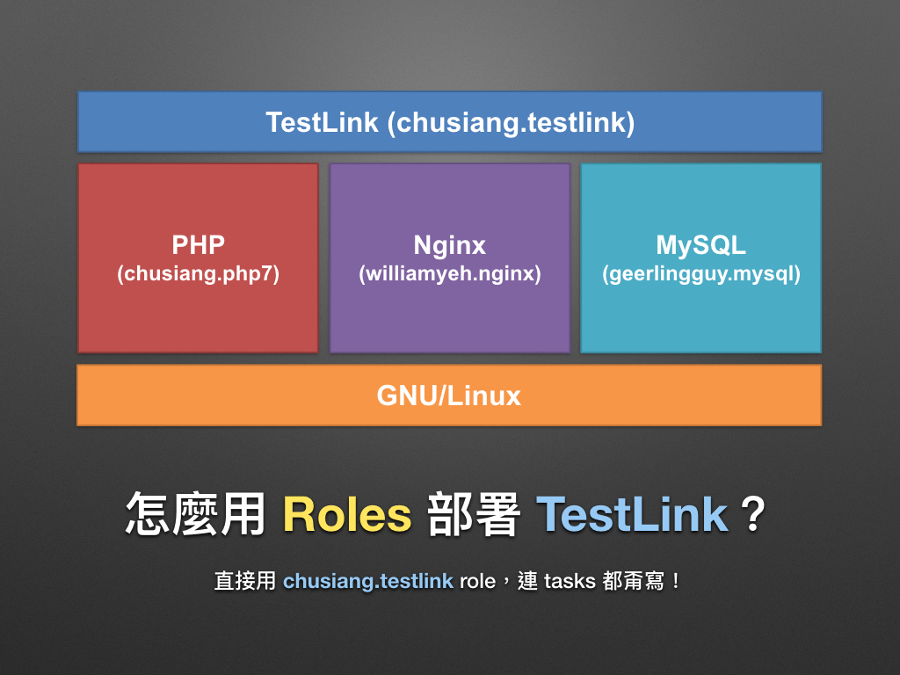
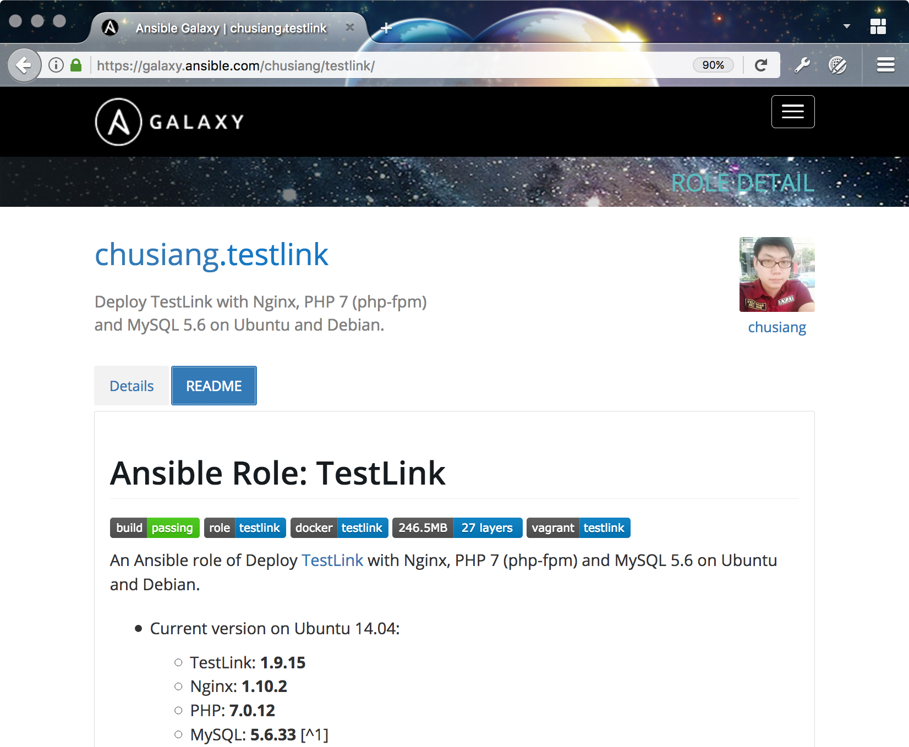

# 現代 IT 人一定要知道的 Ansible 自動化組態技巧

## 24. 怎麼用 Roles 部署 TestLink？

上一章「[23. 怎麼用 Roles 部署 LNMP 網頁應用程式？(下)](23.how-to-setup-lnmp-webapp-with-roles-2.md)」我們用了 3 個 Roles 和自己寫的 Playbook 部署 Testlink 網頁應用程式，接下來凍仁會透過 Roles 展示最精簡的 Playbooks。




### chusiang.testlink 是什麼？

[`chusiang.testlink`][chusiang_testlink_galaxy] 是部署 TestLink 1.9.15 到 Ubuntu 14.04 和 Debian 8 的 Role，並建置在 Nginx 1.10, PHP 7 和 MySQL 5.6 的環境上。

[chusiang_testlink_galaxy]: https://galaxy.ansible.com/chusiang/testlink/

> 凍仁先前幫公司架設 TestLink 時，在 [Ansible Galaxy][ansible_galaxy] 和 [Chef Supermarket][chef_supermarket] 上找不到現成 Roles 和 Cookbooks，索性就自己寫一個。

[ansible_galaxy]: https://galaxy.ansible.com/
[chef_supermarket]: https://supermarket.chef.io/




### 怎麼用 Roles 撰寫最精簡的 Playbooks？

看下去之前，可以先回顧上章，比比看兩者的差異。

#### 使用 Vagrant 建立開發環境

建立 Vagrantfile 檔案。

```ruby
$ vi Vagrantfile
# -*- mode: ruby -*-

Vagrant.configure("2") do |config|
  config.vm.box = "ubuntu/trusty64"
  config.vm.network "private_network", ip: "192.168.33.10"
  config.vm.provider "virtualbox" do |vb|
    vb.memory = "1024"
  end
  config.vm.provision "ansible" do |ansible|
    ansible.playbook = "setup.yml"
    ansible.sudo = true
    #ansible.verbose = "vvv"
  end
end

# vi: set ft=ruby :
```


#### 從 Galaxy 下載 Roles

1. 建立 `requirements.yml`，與上章相比多了 `chusiang.testlink` role。

  ```yaml
  $ vi requirements.yml
  # Nginx 1.10
  - src: williamyeh.nginx
    path: roles/
  
  # PHP 7
  - src: chusiang.php7
    path: roles/
  
  # MySQL 5.6
  - src: geerlingguy.mysql
    path: roles/
  
  # TestLink 1.9.15
  - src: chusiang.testlink
    path: roles/
  ```

1. 藉由 `requirements.yml` 下載多個 Roles。

  ```
  $ ansible-galaxy install -f -p roles -r requirements.yml
  ``` 

#### 撰寫 Playbooks

為便於解說，凍仁將於以下範例加上行號，其原始檔可在 [`lab/ch24/testlink/setup.yml`][ch24_setup_yml] 取得。

[ch24_setup_yml]: https://github.com/chusiang/automate-with-ansible/blob/master/lab/ch24/testlink/setup.yml

```yaml
$ vi setup.yml
01 #!/usr/bin/env ansible-playbook
02 
03 ---
04 - name: deploy testlink with chusiang.testlink role
05   hosts: all
06   become: true
07 
08   roles:
09     - williamyeh.nginx
10     - chusiang.php7
11     - geerlingguy.mysql
12     - chusiang.testlink
13 
14   tasks:
15     - name: include check task
16       include: roles/chusiang.testlink/tasks/check.yml
17 
18   post_tasks:
19     # Run some tests.
20     - include: roles/chusiang.testlink/tests/curl_testlink_web.yml
21 
22 # vim:ft=ansible:
```

- 在第 8-12 行裡，載入了 Nginx, MySQL, PHP 和 TestLink 的 Roles。
- 第 23 行之後的兩個 tasks 是可省略的，這裡只是為了驗證部署狀態而使用。


#### 精簡版的 TestLink Playbooks 檔案結構

把 Playbooks 都封裝成 Roles 之後，可明顯看出整體的檔案結構比上章簡潔許多。

```
$ tree -L 2
.
├── Makefile
├── Vagrantfile
├── ansible.cfg
├── hosts
├── requirements.yml
├── roles
│   ├── chusiang.php7
│   ├── chusiang.testlink
│   ├── geerlingguy.mysql
│   └── williamyeh.nginx
└── setup.yml

5 directories, 6 files
```


#### 執行 Playbooks

1. 啟用虛擬機並執行 Playbook。

  ```
  $ vagrant up
  ```

  

1. 執行完畢後，開啟瀏覽器 (Browsers) 並進入 TestLink 網站 ([http://192.168.33.10][testlink_private])，其帳號密碼皆為 `admin`。

  

[testlink_private]: http://192.168.33.10

以上，這次我們只需維護 `ansible.cfg`, `hosts`, `requirements.yml` 和 `setup.yml`，剩下就交給 Roles 吧！


### 後語

在完成這篇文章的同時，凍仁也順手修了一下 `chusiang.testlink` role 的小小 bug。相信當越多人分享 Roles 到 Galaxy 後，我們可以減少重複性質的工作，並把時間和精力留在更重要的事情上。


### 相關連結

- [chusiang.testlink | Ansible Galaxy][chusiang_testlink_galaxy] 
- [chusiang/testlink.ansible.role | GitHub][chusiang_testlink_github]

[chusiang_testlink_github]: https://github.com/chusiang/testlink.ansible.role

