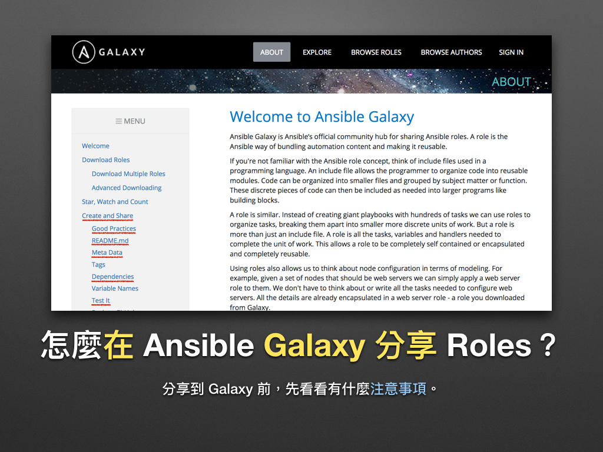

# 現代 IT 人一定要知道的 Ansible 自動化組態技巧

## 25. 怎麼在 Ansible Galaxy 分享 Roles？(上)

在「[23. 怎麼用 Roles 部署 LNMP 網頁應用程式？(下)](23.how-to-setup-lnmp-webapp-with-roles-2.md)」裡，我們寫好了部署 TestLink 的 Playbooks，接下來凍仁將分享上傳至 Galaxy 前的注意事項。




### 怎麼把 Playbooks 打包成 Roles？

範例 `lab/ch23/testlink` 其實就是個把 Playbooks 拆開的 Role，它真正的程式進入點為 `tasks/main.yml`，而 `setup.yml` 只是為了測試 Playbooks 的正確性而存在的。這也是為什麼凍仁會用 `setup.yml` include `tasks/main.yml`，再用 `tasks/main.yml` include 其它 tasks 的原因。

> 在「[19. 如何維護大型的 Playbooks？](19.how-to-maintain-the-complex-playbooks.md)」一文時，凍仁建議大家把 Playbooks 給拆開，為的就是要把它打包成 Roles。

```
$ tree -L 2
.
├── README.md
├── Vagrantfile
├── defaults
│   └── main.yml
├── handlers
│   └── main.yml
├── requirements.yml
├── setup.yml
├── tasks
│   ├── check.yml
│   ├── main.yml
│   ├── setting_nginx.yml
│   ├── setting_php-fpm.yml
│   ├── setting_testlink.yml
│   └── setup_testlink.yml
└── templates
    ├── config_db.inc.php.j2
    ├── nginx-testlink.conf.j2
    ├── php7-cli.ini.j2
    └── php7-fpm.ini.j2

4 directories, 16 files
```

- 此例的 `requirements.yml`, `setup.yml` 只有在作為 Playbooks 用時才會被使用。


### 好的 Roles 應具備什麼？

1. 在 `README.md` 裡提供清楚的說明文件。
1. 在 Meta Data (`meta/main.yml`) 提供正確的資訊。
1. 在 Meta Data (`meta/main.yml`) 寫入 Roles 的相依性 (Dependencies) 設定。
1. 命名變數時，使用 Role 的名稱作為變數的前綴。
1. 藉由 Travis CI 整合測試 Roles。([more](https://galaxy.ansible.com/intro#travis))

  > 就上面的例子而言，我們會用 `setup.yml` 來進行測試。


#### README.md

1. 使用 `ansible-galaxy init` 指令建立 Role 時會一併產生的檔案之一。
1. 使用 Markdown 格式編寫。
1. 內容會顯示在 [README][galaxy_readme] 頁面裡：在 Galaxy 上看到的樣子與 GitHub 相同。

[galaxy_readme]: https://galaxy.ansible.com/chusiang/testlink/#readme

```markdown
$ cat README.md
Role Name
=========

A brief description of the role goes here.

Requirements
------------

Any pre-requisites that may not be covered by Ansible itself or the role should be mentioned here. For instance, if the role uses the EC2 module, it may be a good idea to mention in this section that the boto package is required.

Role Variables
--------------

A description of the settable variables for this role should go here, including any variables that are in defaults/main.yml, vars/main.yml, and any variables that can/should be set via parameters to the role. Any variables that are read from other roles and/or the globalscope (ie. hostvars, group vars, etc.) should be mentioned here as well.

Dependencies
------------

A list of other roles hosted on Galaxy should go here, plus any details in regards to parameters that may need to be set for other roles, or variables that are used from other roles.

Example Playbook
----------------

Including an example of how to use your role (for instance, with variables passed in as parameters) is always nice for users too:

    - hosts: servers
      roles:
         - { role: username.rolename, x: 42 }

License
-------

BSD

Author Information
------------------

An optional section for the role authors to include contact information, or a website (HTML is not allowed).
```
▲ 此為 `ansible-galaxy init` 產生的 READNE.md 範例。


#### Meta Data (`meta/main.yml`)

1. 使用 `ansible-galaxy init` 指令建立 Role 時會一併產生的檔案之一。
1. 使用 YAML 格式編寫。
1. 內容會顯示在 [Details][galaxy_details] 頁面裡面。

[galaxy_details]: https://galaxy.ansible.com/chusiang/testlink/#details

```
$ cat meta/main.yml
galaxy_info:
  author: chusiang
  description: Deploy TestLink with Nginx, PHP 7 (php-fpm) and MySQL 5.6 on Ubuntu and Debian.
  company: commandp Inc.
  license: MIT
  min_ansible_version: 2.1.2.0
  platforms:
  - name: Ubuntu
    versions:
    - trusty
  - name: Debian
    versions:
    - jessie

  galaxy_tags:
    - testlink
    - cms

dependencies:
  - williamyeh.nginx
  - chusiang.php7
  - geerlingguy.mysql
```
▲ 此為 `chusiang.testlink` role 的 `meta/main.yml`。


#### Dependencies

1. 若相依於其它的 role，請於 `meta/main.yml` 的 `dependencies` 下方補上。
1. 使用 YAML 格式編寫。
1. 關於 Role Dependencies 可參考 [Roles - Role Dependencies | Ansible Documentation][ansible_docs_role_dependencies] 一文。

[ansible_docs_role_dependencies]: https://docs.ansible.com/ansible/latest/user_guide/playbooks_reuse_roles.html#role-dependencies

```
$ cat meta/main.yml
...
dependencies:
  - williamyeh.nginx
  - chusiang.php7
  - geerlingguy.mysql
```
▲ 此為 `chusiang.testlink` role 的 `meta/main.yml`。

以上就是要上傳到 Galaxy 前該特別留意的地方，下章凍仁將講解怎麼把 Roles 上傳至 Galaxy。


### 相關連結

- [About | Ansible Galaxy][ansible_galaxy_about]

[ansible_galaxy_about]: https://galaxy.ansible.com/intro#share

