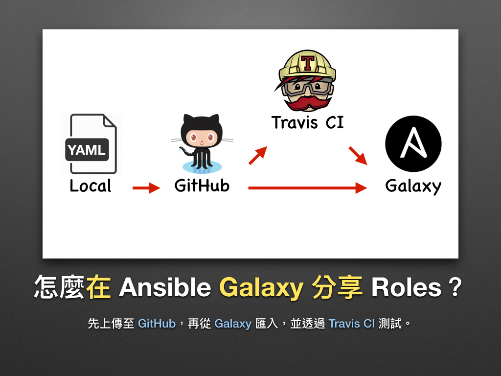
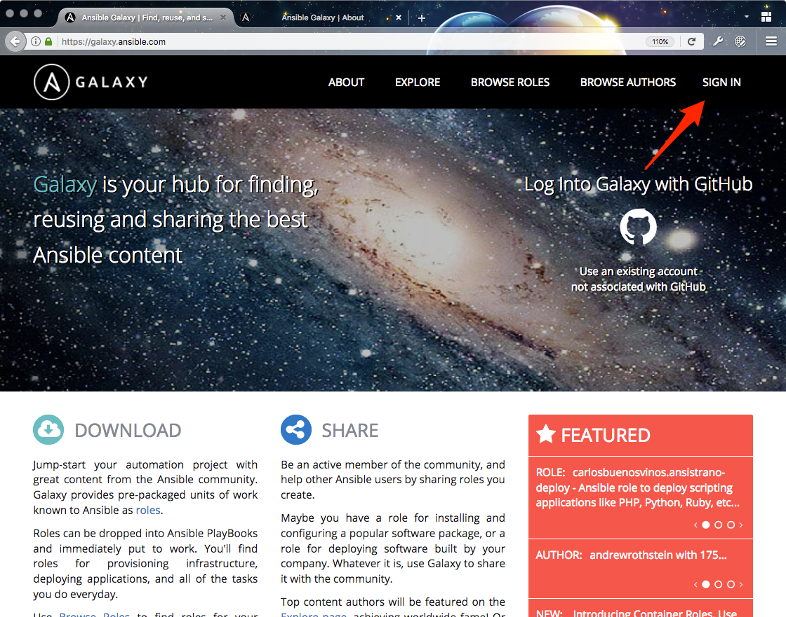
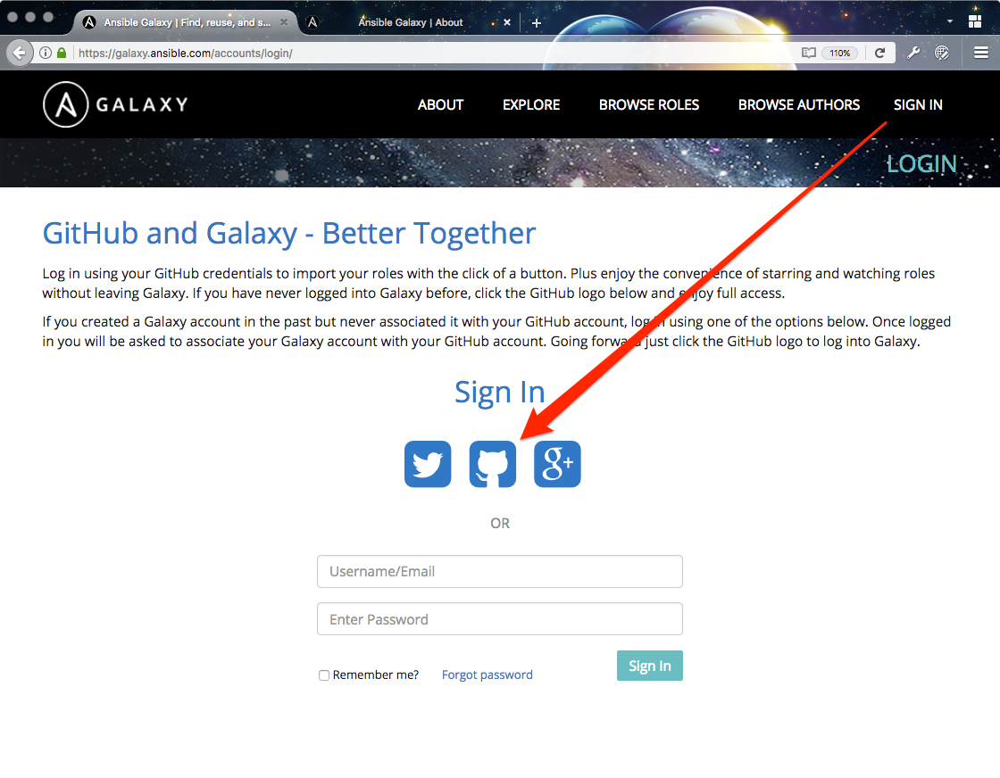
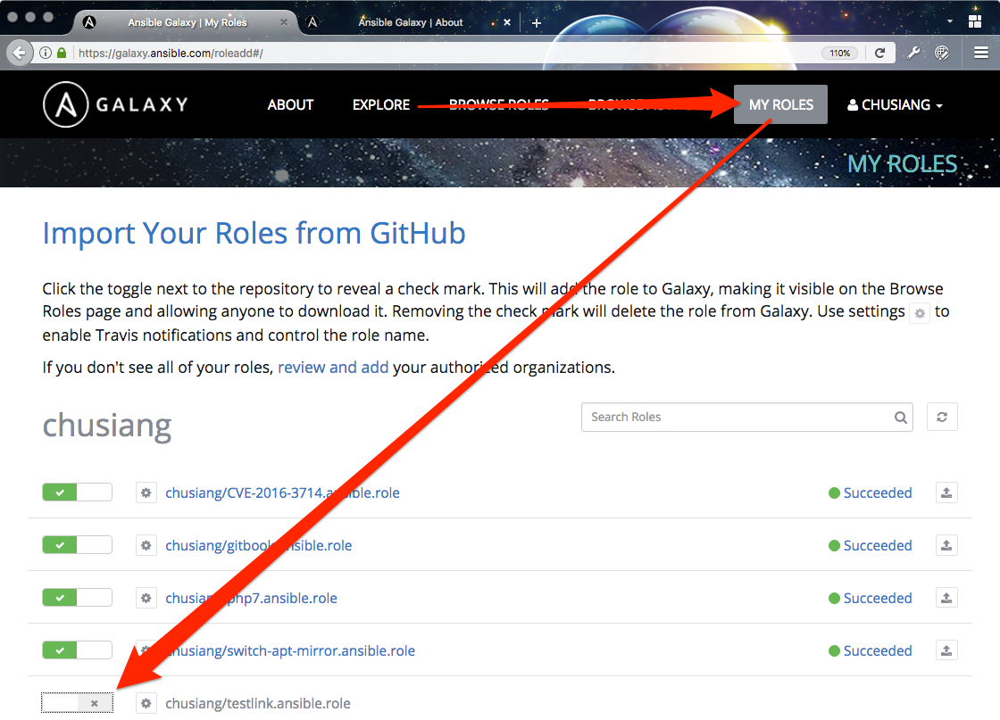
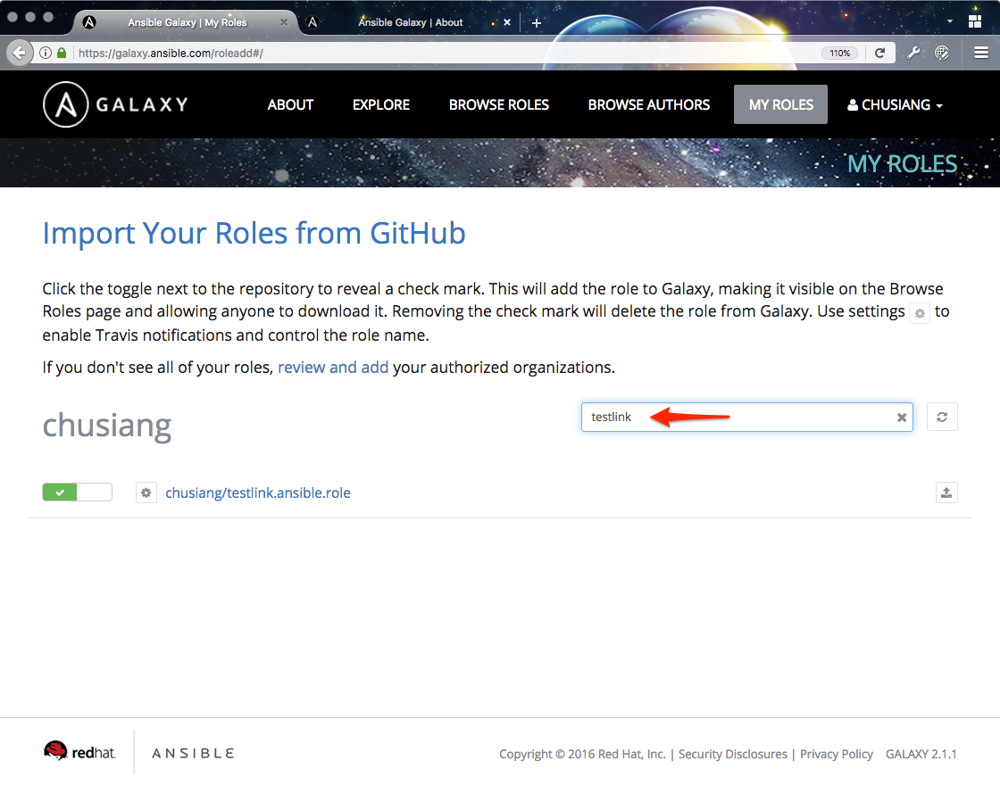
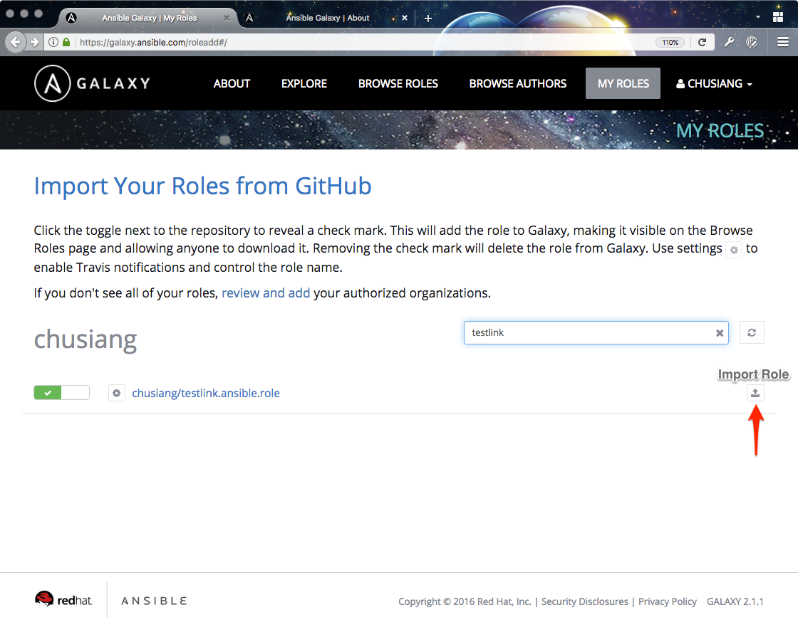
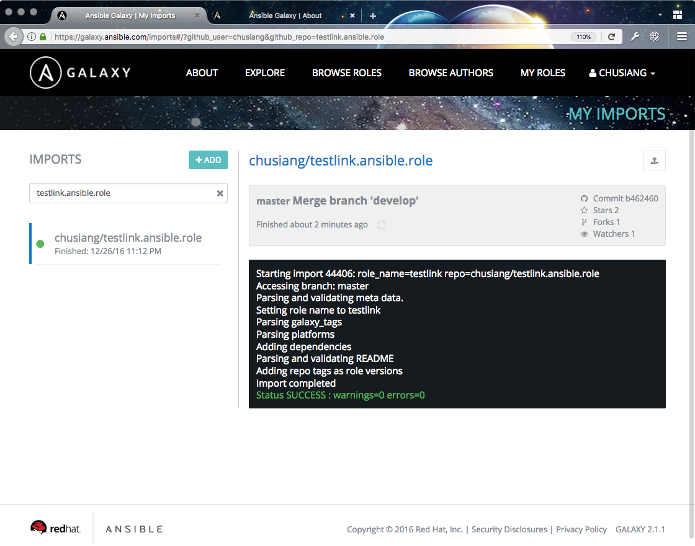
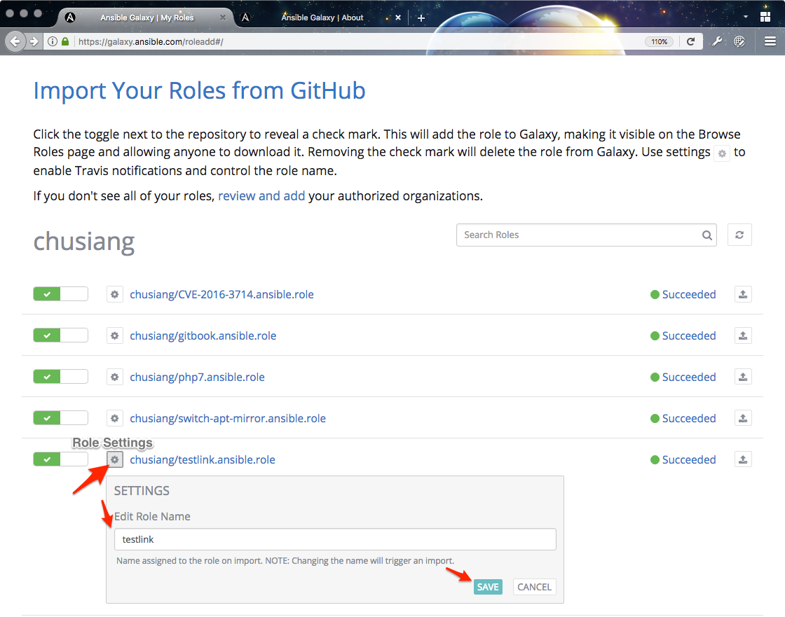

# 現代 IT 人一定要知道的 Ansible 自動化組態技巧

## 26. 怎麼在 Ansible Galaxy 分享 Roles？(下)

上一章「[25. 怎麼在 Ansible Galaxy 分享 Roles？(上)](25.how_to_share_roles_on_galaxy-1.md)」，我們幫 Role 補充了 [Galaxy][ansible_galaxy] 網站所需的資訊，接下來就是把它分享到 Galaxy 上了！



[ansible_galaxy]: https://galaxy.ansible.com/


### 怎麼上傳 Roles 到 GitHub？

先前在「[21. 怎麼使用 Roles？](21.how-to-use-the-roles.md)」一章曾提過，Galaxy 裡的 Roles 其實是存在 GitHub 上的。

1. 在 GitHub 建立一個 Repository (儲存庫) [^1]，官方建議使用 `ansible-role-acme` 的格式進行命名。
1. 把寫好的 Roles 加入 Git 版本控制裡。

  ```
  $ git commit -a
  $ git push
  ```

1. 藉由 **[Git][git_official]** 從本地 (Local) 把 Roles **上傳至 GitHub**。
1. 若對 Git 和 GitHub 不熟，可參考凍仁先前寫的 [Git and Github basic with SourceTree][git_and_github_basic_with_sourcetree] 簡報。

[git_official]: https://git-scm.com/
[git_and_github_basic_with_sourcetree]: https://speakerdeck.com/chusiang/git-and-github-basic-with-sourcetree


### 怎麼在 Galaxy 匯入 Roles？

1. 進入 Galaxy 網站，並點擊右上角的 **SIGN IN**。
  

1. 使用 GitHub OAuth 登入 Galaxy 網站。
  

1. 進入 **My Roles** 頁面，並點選左方按鈕啟用 Roles，完成後將顯示 ✔。
  

1. 當 Roles 太多時，可藉由右方的搜尋框進行過濾。
  

1. 啟用 Role 後，點擊右方的 **Import Role** 圖示進行匯入。
  

1. 匯入成功後將顯示 **Succeeded**，點擊 **Succeeded** 即可觀看這次匯入的相關資訊。
  
  > 我們可藉由此頁面檢查 Meta Data (`meta/main.yml`) 的設定是否有誤。

1. 若想自訂 Role name，可透過 **Role Settings** 進行更改。
  

以上，現在我們可以在 https://galaxy.ansible.com/chusiang/testlink/ 看到剛匯入的 Role，其中 `chusiang` 為 username，`testlink` 為 role name，而完整名稱則是 `chusiang.testlink`。


### 後語

寫完複雜 Playbooks，我們只需再費點工夫就可以在 Galaxy 上與全世界分享了！


### 相關連結

- [Upload to Galaxy | Ansible Galaxy][ansible_galaxy_upload_to_galaxy]

[ansible_galaxy_upload_to_galaxy]: https://galaxy.ansible.com/intro#role-galaxy


[^1]: 若不會在 GitHub 上建立 Repository，可參考 [Create A Repo | GitHub][create_a_repo] 一文。

[create_a_repo]: https://help.github.com/articles/create-a-repo/

