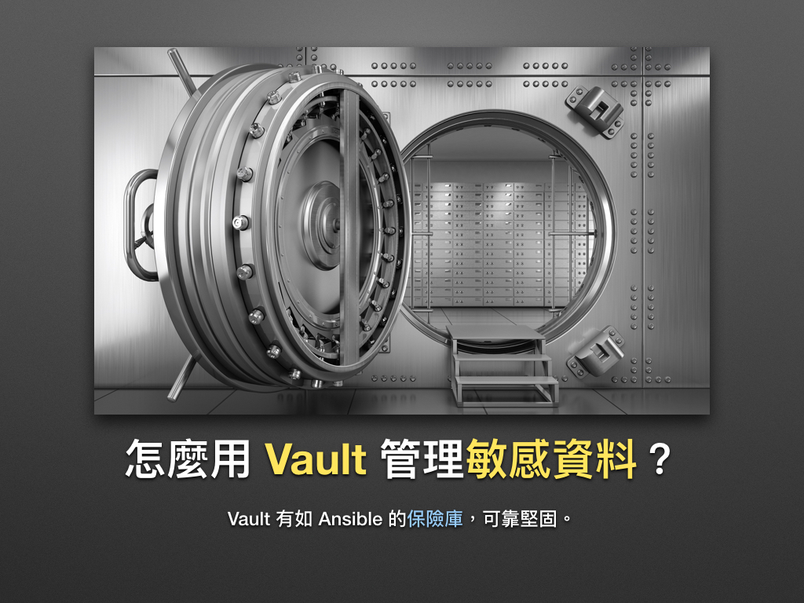
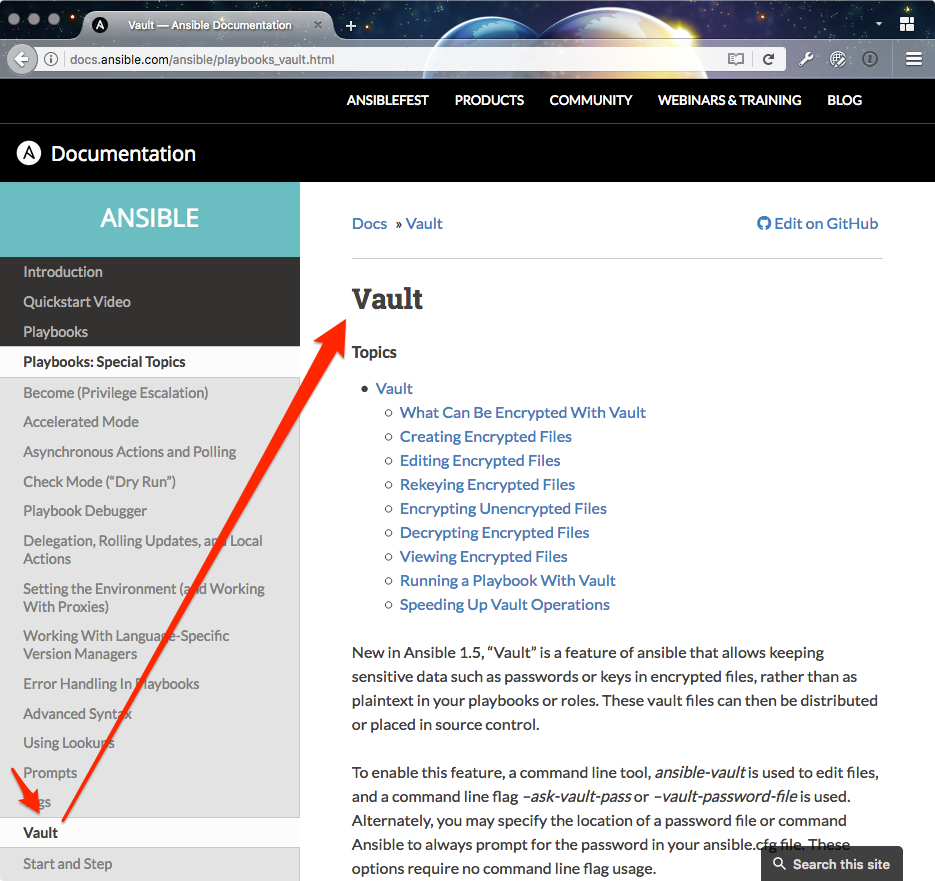
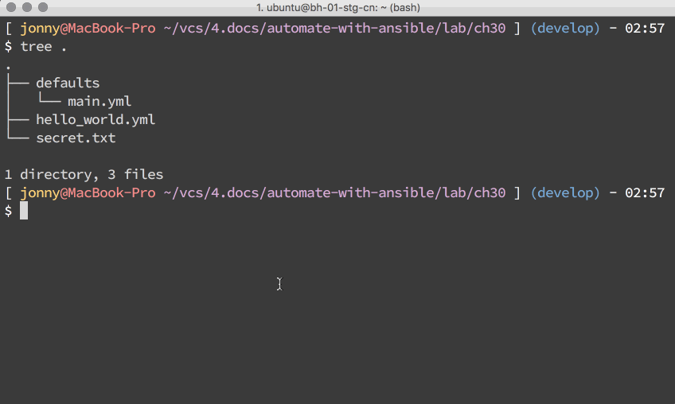

# 現代 IT 人一定要知道的 Ansible 自動化組態技巧

## 30. 怎麼用 Vault 管理敏感資料？

導入 Ansible 組態工具，多少會使用**明文**在 Playbooks 裡存放敏感資料 (sensitive data) [^1]，更別說我們還會搭配 Git 版本系統使用，這很可能會造成潛在的資安風險！接下來凍仁告訴大家怎麼透過 Vault 這個保險庫系統來強化**資料安全**。


圖片來源：http://kingofwallpapers.com/vault.html


### Vault 是什麼？

Vault 就字面上的意義有地窖、**保險庫**的意思。在 Ansible 裡則是指加密、解密檔案的技術，是 Ansible 從 v1.5 開始支援的功能之一，預設使用 [AES 加密技術][wikipedia_aes]，其詳細說明可參考 [Vault | Ansible Documentation][ansible_docs_vault] 官方文件。



[wikipedia_aes]: https://zh.wikipedia.org/zh-tw/高级加密标准
[ansible_docs_vault]: http://docs.ansible.com/ansible/playbooks_vault.html

### 怎麼使用 Vault？

以下皆在終端機 (Terminal) 裡操作。

1. 建立加密 (Encrypted) 檔案。

  ```
  $ ansible-vault create foo.yml
  ```

1. 編輯加密檔案內容。

  ```
  $ ansible-vault edit foo.yml
  ```

1. 更換加密密碼。

  ```
  $ ansible-vault rekey foo.yml
  ```

1. 對明文檔案進行加密。

  ```
  $ ansible-vault encrypt foo.yml
  ```

1. 解開 (Decrypt) 已加密檔案。

  ```
  $ ansible-vault decrypt foo.yml
  ```

1. 檢視已加密檔案的內容。

  ```
  $ ansible-vault view foo.yml
  ```

### 怎麼在 Playbooks 裡使用 Vault？

1. 建立 Playbook。

  ```
  $ vi hello_world.yml
  ---
  - name: say 'hello world'
    hosts: all
    vars_files:
      - defaults/main.yml
    tasks:
      - name: echo 'hello world'
        command: echo 'hello {{ world }}'
        register: result
      - name: print stdout
        debug:
          msg: "{{ result.stdout }}"
  
  # vim: ft=ansible :
  ```

1. 建立變數檔案。

  ```
  $ vi defaults/main.yml
  world: 'ironman'
  ```

1. 將變數檔案進行加密：過程中需輸入兩次密碼。

  ```
  $ ansible-vault encrypt defaults/main.yml
  New Vault password:
  Confirm New Vault password:
  Encryption successful
  ```

1. 檢視已加密的檔案內容：使用剛剛輸入的密碼進行檢視。

  ```
  $ ansible-vault view defaults/main.yml
  Vault password:
  world: 'ironman'
  ```

1. 執行 Playbook 並手動輸入密碼。

  ```
  $ ansible-playbook hello_world.yml --ask-vault-pass
  ```

1. 建立密碼檔：此例用的密碼為 `bGpvxx`。

  ```
  $ echo 'bGpvxx' > secret.txt
  ```

1. 執行 Playbook 並代入密碼檔。

  ```
  $ ansible-playbook hello_world.yml --vault-password-file secret.txt
  ```

1. 最後附上小小的 Playbook + Vault 展示。
  


### 後語

或許大家覺得在本機儲存敏感資料很安全，但誰又能保證傳輸過程中不會被竊取？

在某些敏感的企業 (例如醫療業) 還會要求使用 BitLocker, FileVault 這類的技術對整顆硬碟進行加密，為防電腦遭竊時造成二度傷害！


### 相關連結

- [Vault | Ansible Documentation][ansible_docs_vault]
- [《雲端資安與隱私｜企業風險應對之道》][cloud_security_and_privacy]
- [Windows 7 BitLocker 磁碟機加密設計指南 | Microsoft][win7_bitlocker]

[ansible_docs_vault]: http://docs.ansible.com/ansible/playbooks_vault.html
[cloud_security_and_privacy]: http://books.gotop.com.tw/o_A270
[win7_bitlocker]: https://technet.microsoft.com/zh-tw/library/ee706536(v=ws.10).aspx


[^1]: 資料庫伺服器 (database server) 的連線資訊、第三方服務的 Access Key 和 Secret 等都算是敏感資料的一種，。

